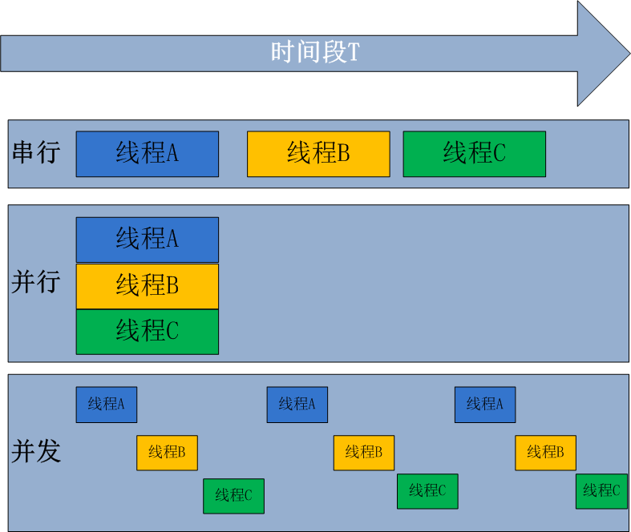
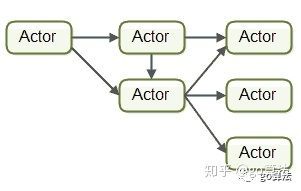
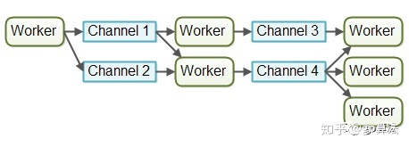
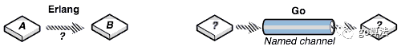
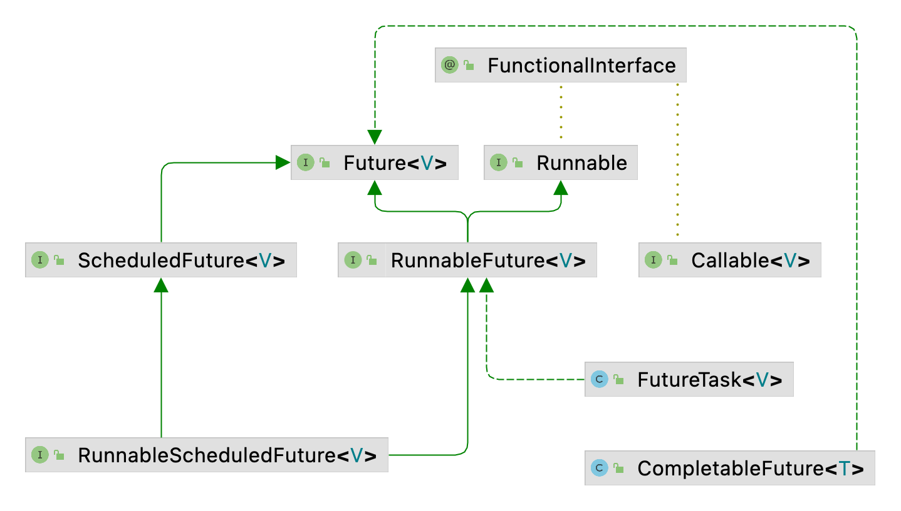
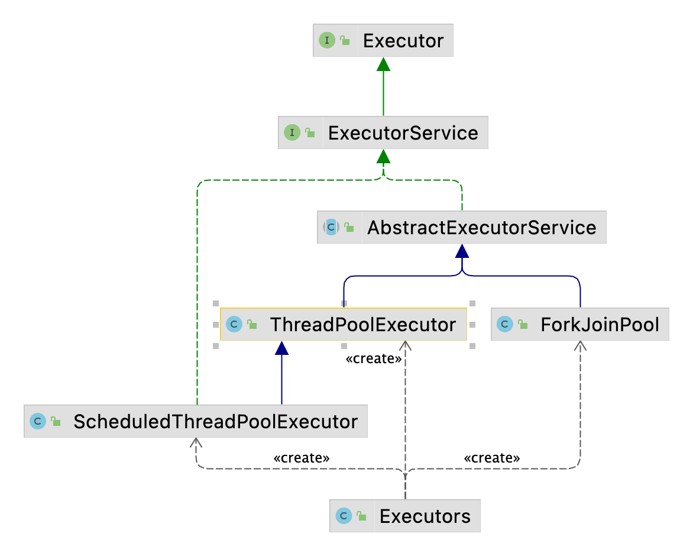
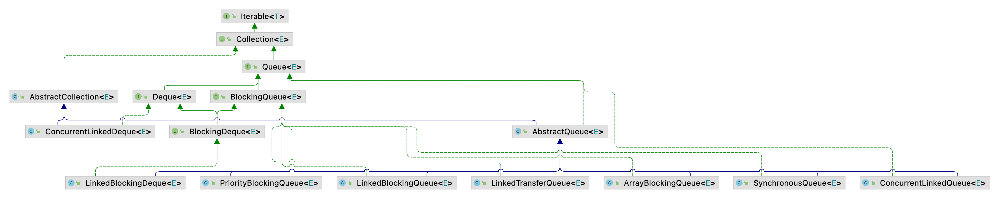
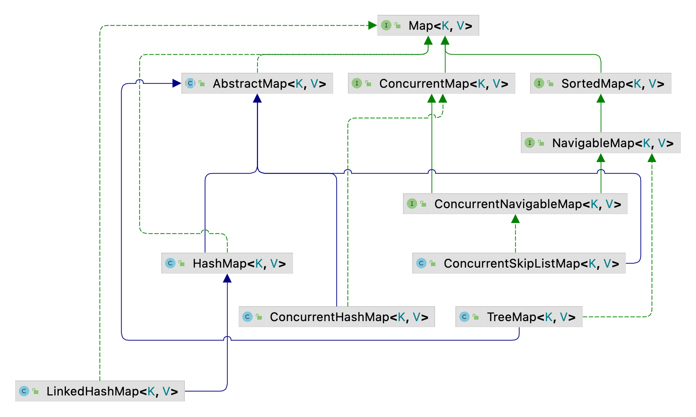
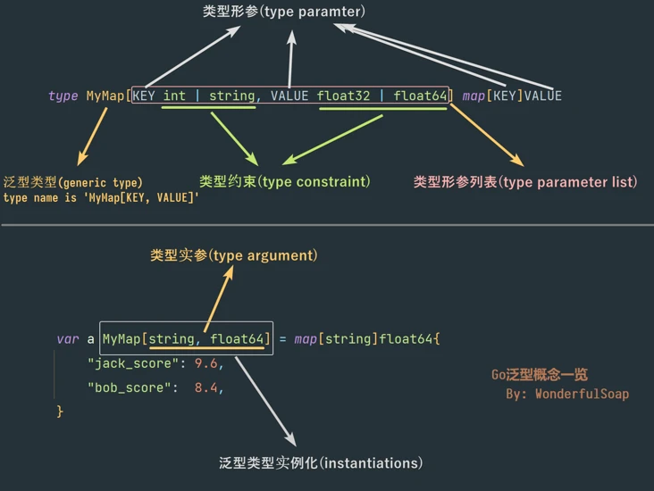

# 前言

## 动态语言 vs 静态语言

### 概念

**动态语言（弱类型语言）**

- 运行时才确定数据类型的语言，变量在使用之前无需申明类型，通常变量的值是被赋值的那个值的类型。比如Php、Asp、JavaScript、Python、Perl等等。
- 必须强制确定数据类型的语言，一旦一个变量被指定了某个数据类型，如果不经过强制转换，那么它就永远是这种数据类型。一个变量的类型是申明的时候就已经确定的，更安全。

**静态语言（强类型语言）**

- 编译时变量的数据类型就可以确定的语言，大多数静态语言要求在使用变量之前必须生命数据类型。比如Java、C、C++、C#等。数据类型可以被忽略的语言。
- 它与强类型语言相反，一个变量可以赋不同数据类型的值。一个变量的类型是由其上下文决定的，效率更高。

### 区别

- 静态语言
  - 由于强制声明数据类型，让开发工具（IDE）对代码有很强的判断能力，在实现复杂的业务逻辑和开发大型商业系统、以及那些声明周期很长的应用中，开发者可以依托强大的IDE来更高效、更安全地开发。
  - 编译器可以执行各种检查，也就是程序还没跑起来就能找到一些小错误，也就是是在compile-time 检查出错误的。
- 动态语言
  - 思维不受约束，可以任意发挥，把更多的精力放在产品本身上；集中思考业务逻辑实现，思考过程就是实现过程。
  - 开发一个大型应用程序,有一个函数期望接收一个叫作 ID 的字段。这个参数应该是整数,是字符串,还是一个 UUID?要想知道答案,只能去看源代码。可以尝试使用一个数字或者字符串来执行这个函数,看看会发生什么。
  - 可能代码开发快，但是维护难（但是脚本语言平常写的代码量应该不太多，还比较好debug和修改）

# 一、语言基础

## 1、数据类型

### 1.1、类型概述

#### a、Java

在java语言中，变量分为两种：基本类型和引用类型。

基本数据类型是CPU可以直接进行运算的类型。Java定义了以下几种基本数据类型：

- 整数类型：byte、short、int、long
- 浮点数类型：float、double
- 字符类型：char
- 布尔类型：bool

#### b、Go

在Go语言中，数据类型用于声明函数和变量。

数据类型的出现是为了把数据分成所需内存大小不同的类型，编程的时候需要用大数据的时候才需要申请大内存，就可以充分利用内存。

所有类型都能赋值给interface{}空接口；GO语言中没有类的概念，只能通过struct和method来模拟；

Go语言按类别有以下几种数据类型：

1. 布尔型：bool
2. 数字类型：
   - 无符号整数：uint8、uint16、uint32、uint64
   - 有符号整数：int8、int16、int32、int64
   - 浮点数：float32、float64
   - 布尔：bool
   - 其它类型：
     - byte、uint8 ：两种类型可以互换，是一回事
     - rune、int32：两种类型可以互换，是一回事
     - int、uint：长度由CPU的位数决定(32或64位)、
     - uintptr：无符号整型，用于存放一个指针
   - 复数：complex64、conplex128
   - 字符：byte/uint8、rune 
     - uint8/byte代表ASCII的一个字符
     - rune代表一个UTF-8字符，代表中文、韩文等字符。
3. 字符串类型：string
4. 派生类型：
   - 指针类型（pointer）
   - 数组类型：
   - 结构体：struct
   - channel类型
   - 函数类型
   - 切片类型
   - 接口类型（interface）
   - Map类型

#### c、Python

Python中一切事物皆对象，变量是对对象在内存中的存储和地址的抽象。

变量就是变量，它没有类型；Python使用对象模型来存储数据，构造任何类型的值都是对象。对象都拥有三个特性：身份、类型、值。

身份：每个对象都有一个唯一的身份标识自己，任何对象的身份都可以通过内建函数id()来得到。

类型：对象的类型决定了对象可以保存什么类型的值，可以进行什么样的操作，以及遵循什么样的规则。可以通过type()查看对象类型。返回的是对象而不是简单的字符串。

值：对象表示的数据

Python3中有六个标准数据类型：

1. Number（数字）：int、float、bool、complex(复数)
2. String（字符串）
3. Tuple（元组）
4. List（列表）
5. Set（集合）
6. Dictionary（字典）

- 不可变数据类型：Number、String、Tuple
- 可变数据类型：List、Dictionary、Set

#### d、JavaScript

JavaScript变量均为对象。当声明一个变量时，就创建了一个新的对象。

JavaScript不区分整数和浮点数，统一使用Number表示。

值类型（基本类型）：String、Number、Boolean、Null、Undefined、Symbol

引用类型（对象类型）：Object、Array、Function、RegExp、Date

```javascript
console.log("------------------typeof-------------------------")
console.log(typeof 1)       // number
console.log(typeof 3.14)    // number
console.log(typeof 'abc')   // string
console.log(typeof "123")   // string
console.log(typeof true)    // boolean
console.log(typeof undefined)   // undefined
console.log(typeof function () {
})   // function
console.log(typeof [1, 2, 3])     // object
console.log(typeof new Array()) // object
console.log(typeof new Date())  // object
console.log(typeof null)        // object
console.log(typeof new Map())   // object
console.log(typeof new Set())   // object

// typeof 根本无法区分Object类型中的Array、Date、Map、Set等类型
// 使用Object.prototype.toString 可以解决此问题

console.log("------------------constructor.name-------------------------")
int1 = 1
console.log(int1.constructor.name)       // Number
console.log(3.14.constructor.name)    // Number
console.log('abc'.constructor.name)   // String
console.log("123".constructor.name)   // String
console.log(true.constructor.name)    // Boolean
// console.log(undefined)   // 无法使用constructor.name
console.log(function () {
}.constructor.name)   // Function
console.log([1, 2, 3].constructor.name)     // Array
console.log(new Array().constructor.name) // Array
console.log(new Date().constructor.name)  // Date
// console.log(null)        // 无法使用constructor.name
console.log(new Map().constructor.name)   // Map
console.log(new Set().constructor.name)   // Set
```


### 1.2、数据类型对比

| 类型       | Java                   | Go                                      | Python          | JavaScript      | 备注                                                         |
| ---------- | ---------------------- | --------------------------------------- | --------------- | --------------- | ------------------------------------------------------------ |
| byte       | byte                   | byte                                    |                 |                 |                                                              |
| bool       | bool                   | bool                                    | <class,bool>    |                 |                                                              |
| 有符号整数 | short/int/long         | int8/int16/int32/int64/int/rune         | <class,int>     |                 | Python bool继承int,可以当成int的0或1                         |
| 无符号整数 | --                     | uint8/uint16/uint32/uint64/uint/uintptr | --              |                 |                                                              |
| 浮点数     | float/double           | float32/float64                         | <class,float>   |                 |                                                              |
| 复数       | --                     | complex                                 | <class,complex> | --              |                                                              |
| 字符       | char                   | byte/uint8/rune                         | --              |                 | Go中字符有2种，uint8/byte代表ASCII的一个字符，rune代表一个UTF-8字符 |
| 指针       | --                     | pointer                                 | --              | --              |                                                              |
| 字符串     | String                 | string                                  | <class,str>     | String          |                                                              |
| 空         | null                   | nil                                     | None            | null、undefined |                                                              |
| 元组       | --                     | --                                      | <class,tuple>   | --              |                                                              |
| 数组       | Array                  | array                                   | --              | Array           |                                                              |
| List       | ArrayList/LinkedList等 | slice                                   | <class,list>    | List            |                                                              |
| Map        | HashMap/TreeMap等      | map                                     | <class,dict>    | Map             |                                                              |
| Set        | HashSet/TreeSet等      | --                                      | <class,set>     | Set             |                                                              |
| 结构体     | --                     | struct                                  | --              | --              |                                                              |
| 函数       | 成员函数               | func（函数和方法）                      | def             | Function        |                                                              |
| 接口       | Interface              | interface                               |                 | --              |                                                              |
| 类         | Class                  | --                                      | Class           | Class           |                                                              |
| Channel    | --                     | channel                                 | --              | --              |                                                              |

## 2、变量
### 2.1、变量声明(定义)

#### a、Java

```java
// 方式一： 数据类型 变量名 = 赋值;
// 方式二： var 变量名 = 赋值;  // JDK10 局部变量类型推断，可以使用var代替实际类型

String name = "skwqy";
int age = 100;
var name2 = "skwqy";
```

#### b、GO

```go
// 方式一： var 变量名 数据类型 = 赋值	  	// 完整形式
// 方式二： var 变量名 = 赋值           	// 类型推断，省略数据类型
// 方式三： 变量名 := 赋值			        	// 简短声明，省略var关键字

var name string = "skwqy"
var name = "skwqy"
name := "skwqy"
```

#### c、Python

```python
# Python中变量不需要声明。每个变量在使用前都必须赋值，变量赋值以后该变量才会被创建
name = 'skwqy'
name2 = "sk"
x = 10
```

#### d、JavaScript

```javascript
// 方式一： var 变量名 = 赋值
// 方式二： let 变量名 = 赋值 （推荐）
// 方式三： const 变量名 = 赋值 （常量）
// let 声明的变量仅在块级作用域中有效。注意：let不允许在相同的作用域内，重复声明同一个变量。
// -------------------------------------------------
{
    let a = 10;
    var b = 1;
}
a // ReferenceError: a is not defined. 
b //1
// -------------------------------------------------
var a = [];
for (var i = 0; i < 10; i++) {
  var c = i;
  a[i] = function () {
    console.log(c);
  };
}
a[6](); // 9
// --------------------------------------------------
var a = [];
for (let i = 0; i < 10; i++) {
  let c = i;
  a[i] = function () {
    console.log(c);
  };
}
a[6](); // 6
```


### 2.2、常量

常量一旦声明，常量的值就不能改变。

#### a、Java

```java
// Java 常量使用final来修饰
public static final float PI = 3.14;
```

#### b、Go

```Go
// Go 常量使用const来修饰
const PI float32 = 3.14
const PI2 = 3.14
```

#### c、Python

```python
# Python 中没有定义常量的关键字，也不存在受编译器保护的常量
# 常量只是程序员之间的默契，不收解析器的保护：使用大写字母和下划线来表示常量
PI = 3.14
```

#### d、JavaScript

```javascript
const PI = 3.14
```

### 2.3、常用数据结构

#### 2.3.1、字符串


##### 1、字符串的声明和定义

###### a、Java

```java
// 方式一：字面量定义，常量池
String name = "字符串定义";
            
// 方式二：new 对象定义，堆中
String name2 = new String("字符串定义2");

// 方式三：局部变量推断,仅限于函数内部定义局部变量 JDK提供该功能
var name3 = "字符串定义3";

// 方式4：Text块 JDK14提供该功能
String names = """
        hello
        skwqy
        周峰
        """;
```

###### b、Go

```go
// 方式一：通过双引号创建字符串
var name string = "字符串"

// 方式二：通过反引号(``)来创建，也称为原始文本。不支持转义字符，可以跨越多行，可以包含除反引号之外的任何字符。
// 通常，它用于在正则表达式或HTML中编写多行消息。
var name2 string = `hello
skwqy`
```

###### c、Python

Python中没有字符类型，一个字符也是字符串。

```python
# 方式一： 单引号，单行,可以包含双引号
name = '我叫"老大哥"'
# 方式二： 双引号，单行，可以包含单引号
name2 = "请叫我'老大哥'"
# 方式三：三个单引号，多行，可以包含单、双引号
name3 = '''请叫我
"老大哥'你好'"'''
# 方式四： 三个双引号，多行，可以包含单、双引号
name4 = """请叫我
'老大哥'
"你好"
"""

# 原始字符串,字符串不会转义，原样输出
# 方式一：不能包含单引号(')
rname = r'test\t123'
# 方式一：不能包含双引号(")
rname2 = R"test\t123"
# 方式三：可以包含单、双引号
rname3 = r'''姓名'''
# 方式四：可以包含单、双引号
rname4 = R"""姓名"""
```

###### d、JavaScript

```javascript
// 方式一：单引号，字符串内容可以包含双引号
var name1 = '请叫我"老大哥"'

// 方式二：双引号，字符串内容可以包含单引号
let name2 = "请叫我'老大哥'"

// 方式三：反引号,多行字符串，可以包含单、双引号
const name3 = `请叫我
"老大哥"
'OK'`
```

##### 2、字符子串

###### a、Java

```java
String oriStr="012345678";
String sub1 = oriStr.substring(1);  // 12345678
String sub2=oriStr.substring(2,5);  // 234
```

###### b、Go

```go
var oriStr = "012345678"
println(oriStr[1:])  // 12345678
println(oriStr[2:5]) // 234
println(oriStr[:5])  // 01234
```

###### c、Python

```python
oriStr = "012345678"
print(oriStr[1:])   # 12345678
print(oriStr[2:5])  # 234
print(oriStr[:5])   # 01234
```

###### d、JavaScript

```javascript
let oriStr = "012345678"
console.log(oriStr.substring(1))        // 12345678
console.log(oriStr.substring(2,5))      // 234
```

##### 3、字符串分割

###### a、Java

```java
String oriStr="123:456:789";
String[] members = oriStr.split(":");
```

###### b、Go

```go
findStr := "123:456:789"
arr := strings.Split(findStr, ":")
fmt.Println(arr) // [123 456 789]
```

###### c、Python

```python
findStr = "123:456:789"
arr = findStr.split(":")
print(arr)  # ['123', '456', '789']
```

###### d、JavaScript

```javascript
findStr = "123:456:789"
arr = findStr.split(":")
console.log(arr)    // [ '123', '456', '789' ]
```

##### 4、字符串查找

###### a、Java

```java
String oriStr = "123:456:789:我爱中国";
int index = oriStr.indexOf(":");
System.out.println(oriStr.substring(index));        // :456:789:我爱中国
int lastIndex = oriStr.lastIndexOf(":");
System.out.println(oriStr.substring(lastIndex));    // :我爱中国
```

###### b、Go

```go
findSubStr := "123:456:789:我爱中国"
index := strings.IndexAny(findSubStr, ":")
fmt.Println(findSubStr[index:]) // :456:789:我爱中国
lastIndex := strings.LastIndexAny(findSubStr, ":")
fmt.Println(findSubStr[lastIndex:]) //:我爱中国
```

###### c、Python

```python
findSubStr = "123:456:789:我爱中国"
index = findSubStr.find(":")
print(findSubStr[index:])  # :456:789:我爱中国
lastIndex = findSubStr.rfind(":")
print(findSubStr[lastIndex:])  # :我爱中国
```

###### d、JavaScript

```javascript
findSubStr = "123:456:789:我爱中国"
index = findSubStr.indexOf(":")
console.log(findSubStr.substring(index)) // :456:789:我爱中国
lastIndex = findSubStr.lastIndexOf(":")
console.log(findSubStr.substring(lastIndex)) //:我爱中国
```


##### 5、字符替换

###### a、Java

```java

```

###### b、Go

```go

```

###### c、Python

```python

```

###### d、JavaScript

```javascript

```


#### 2.3.2、数组

Java和Go语言中的数组在创建时需要指定存放数据类型和数组大小，数组一旦创建，其大小是不能改变的。且数组中存放的数据类型也是确定的，虽然Go语言可以创建interface{}数组来存放任何数据类型（包含基本数据类型int8、uint8等）

Python和JavaScript这种动态语言中的数组在创建时，不需要指定大小和数据类型。无需指定大小这种特性更想Java中的List和Go中的切片Slice。

##### 1、数组创建

###### a、Java

```java
// 方式一：
String[] names = new String[3];
names[0] = "skwqy";
names[1] = "sk";
names[2] = "skwqy2";

String[] names1 = new String[]{"skwqy", "sk", "skwqy2"};
System.out.println(names1.length); // 3

// 方式二：
String[] names2 = {"skwqy", "sk", "skwqy2"};
System.out.println(names2.length);// 3
```

###### b、Go

```go
// 方式一：指定容量，创建
var names [3]string
names[0] = "小明"
names[1] = "王二狗"
fmt.Println(names)                  // [小明 王二狗 ]
fmt.Println(len(names), cap(names)) // 3 3

// 方式二：指定容量，创建并初始化
var name2 [3]string = [3]string{"王二狗", "李小花", "张三丰"}
fmt.Println(name2) // [王二狗 李小花 张三丰]

// 方式三：指定容量，按照索引进行初始化
name3 := [3]string{1: "郭靖", 2: "黄蓉"}
fmt.Println(name3) // [ 郭靖 黄蓉]

// 方式四：匹配容量，
name4 := [...]string{"0", "1", "2", "3"}
fmt.Println(name4)                  // [0 1 2 3]
fmt.Println(len(name4), cap(name4)) // 4 4

// 方式五：匹配容量，指定索引
name5 := [...]string{0: "姓名0", 6: "姓名6"}
fmt.Println(name5)                  // [姓名0      姓名6]
fmt.Println(len(name5), cap(name5)) // 7 7
```

###### c、Python

```python
# Python 中没有数组的概念
```

###### d、JavaScript

```javascript
// JavaScript中的数组更向Java中的List，Go中的Slcie，放到List结构中进行对比
```


##### 2、数组遍历

###### a、Java

```java
String[] names = {"欧阳修", "苏轼", "王安石"};
// 方式一：
for (int index = 0; index < names.length; index++) {
    var name = names[index];
    System.out.println(name);
}

// 方式二：
for(var name:names){
    System.out.println(name);
}

// 方式三：
Arrays.stream(names).forEach(name-> System.out.println(name));
```

###### b、Go

```go
namess := [...]string{"欧阳修", "苏轼", "王安石"}
// 方式一
for i := 0; i < len(namess); i++ {
	fmt.Println(namess[i])
}

// 方式二
for index, name := range namess {
	fmt.Println(index, name)
}
```

###### c、Python

```python
# Python 中没有数组的概念
```

###### d、JavaScript

```javascript
// JavaScript中的数组更向Java中的List，Go中的Slcie，放到List结构中进行对比
```

#### 2.3.3、List 切片

Java中的List是定义为接口，jdk包括用户都可以基于该接口实现自己的List实现类。当前Java中实现List接口的数据结构有：

- ArrayList：非线程安全，底层数组数组实现
- LinkedList：非线程安全，底层使用链表实现
- CopyOnWriteArrayList：线程安全
- ......

Go、Python、JavaScript的类List都是编程语言内置的，Go语言的Slice、Python的<class 'list'>、JavaScript的Array都是语言内置的，提供容量动态增长特性，并提供丰富的操作接口。

##### 1、创建

###### a、Java

```java
// 方式一：
var list1 = new ArrayList<>(20);

// 方式二：
var list2 = Arrays.asList("王安石", "苏轼");

// 方式三：
var list3 = List.of("王安石", "苏轼");

// 方式四：
var list4 = Stream.of("王安石", "苏轼").toList();
```

###### b、Go

```go
// 1. 数组
var arr [3]string

// 2.切片
// 方式一：
var s1 []string                                 // 注意没有长度，有长度的是数组，没有长度的是切片slice
fmt.Printf("容量:%d， 长度:%d \n", cap(s1), len(s1)) // 容量:0， 长度:0

// 方式二：和方式一没啥区别，就是创建并初始化
s2 := []string{"王安石", "苏轼"}
fmt.Printf("容量:%d， 长度:%d \n", cap(s2), len(s2)) // 容量:2， 长度:2
fmt.Printf("%T,%T\n", arr, s2)                  // [3]string,[]string

// 方式三：指定长度和容量
s3 := make([]string, 3, 8)
fmt.Printf("容量:%d， 长度:%d \n", cap(s3), len(s3)) // 容量:8， 长度:3

// 特殊情况，如果切片类型为interface{}时，可以存放任意的数据类型
s4 := []interface{}{1, 2, 3.14, "王安石"}
fmt.Println(s4) // [1 2 3.14 王安石]
```

###### c、Python

```python
# Python的List中可以存放任意类型的数据
names = ["王安石", "苏轼", 10, True, [1, 2]]
print(names) # ['王安石', '苏轼', 10, True, [1, 2]]
```

###### d、JavaScript

```javascript
// JavaScript 的Array可以包含任意数据类型

// 方式一：推荐
let arr = [1, 2, 3.14, 'Hello', null, true, [2, false, 'sk']]
console.log(arr) // [ 1, 2, 3.14, 'Hello', null, true, [ 2, false, 'sk' ] ]

// 方式二：不推荐
let arr2 = new Array()  // 不推荐
console.log(arr2) // []
```

##### 2、遍历

###### a、Java

```java
var names = Arrays.asList("王安石", "苏轼");
// 方式一：
for (int i = 0, len = names.size(); i < len; i++) {
    System.out.println(names.get(i));
}

// 方式二：
var ite = names.iterator();
while (ite.hasNext()) {
    System.out.println(ite.next());
}

// 方式三
for(var name:names){
    System.out.println(name);
}
```

###### b、Go

```go
names := []string{"王安石", "苏轼"}
// 方式一
for i := 0; i < len(names); i++ {
	fmt.Println(names[i])
}

// 方式二
for index, name := range names {
	fmt.Println(index, name)
}
```

###### c、Python

```python
names = ["王安石", "苏轼"]

# 方式一
for name in names:
    print(name)

# 方式二：带有index (0, '王安石') (1, '苏轼')
for name in enumerate(names):
    print(name)

# 方式三：
for name in iter(names):
    print(name)

# 方式四
for i in range(len(names)):
    print(i, names[i])
```

###### d、JavaScript

```javascript
let names = ["王安石", "苏轼"]
// 方式一：for/while 根据数组长度遍历
for (let i = 0, len = names.length; i < len; i++) {
    console.log(names[i])
}

// 方式二： for...in 可以遍历对象/数组。遍历数组时也会遍历非数字键名，所以不推荐for...in遍历数组
for (let key in names) {
    console.log(names[key])
}

// 方式三：for...of (ES6)
for(let name of names){
    console.log(name)
}

// 方式四：forEach()方法
names.forEach(name=>console.log(name))
```

##### 3、增删改

###### a、Java

```java
var names = new ArrayList<String>();
// 1. 添加元素
names.add("王安石");  // 方式一：添加到末尾
names.add(0, "苏轼"); // 方式二：添加到指定位置
System.out.println(names); // [苏轼, 王安石]

// 2. 删除元素
names.remove("王安石");  // 方式一：根据元素
System.out.println(names); // [苏轼]
names.remove(0); // 方式二：根据索引
System.out.println(names); // []
names.add(0, "欧阳修");
var ite = names.iterator();
while (ite.hasNext()) {
    String name = ite.next();
    if ("欧阳修".equals(name)) {
        ite.remove();   // 方式三：使用迭代器删除
    }
}
System.out.println(names); // []

// 3. 修改元素
names.add("王安石");  // [王安石]
System.out.println(names);
names.set(0, "欧阳修");
System.out.println(names); // [欧阳修]
```

###### b、Go

```go
// 1. 增加元素
names = []string{}
names = append(names, "王安石", "曾巩")             // 方式一：在末尾插入
fmt.Printf("指向地址:%p， 切片内容：%s\n", names, names) //指向地址:0xc00005a060， 切片内容：[王安石 曾巩]
names = append(names[:1], "苏轼")                // 方式二：在指定位置插入，插入时会覆盖后面位置元素
fmt.Printf("指向地址:%p， 切片内容：%s\n", names, names) //指向地址:0xc00005a060， 切片内容：[王安石 苏轼]

// 2. 删除元素
names = append(names, "柳宗元")
fmt.Printf("指向地址:%p， 切片内容：%s\n", names, names) // 指向地址:0xc0000200c0， 切片内容：[王安石 苏轼 柳宗元]
names = append(names[:1], names[2:]...)        // 删除第二个元素 [0,1)+[2,结束+1)
fmt.Printf("指向地址:%p， 切片内容：%s\n", names, names) // 指向地址:0xc0000200c0， 切片内容：[王安石 柳宗元]

// 3. 修改元素
names[1] = "李元龙"
fmt.Println(names) // [王安石 李元龙]
```

###### c、Python

```python
names = ["王安石"]
# 1. 增加元素
names.append("苏轼")  # 方式一：在末尾添加
names.insert(0, "柳宗元")  # 方式二：在指定位置添加
print(names)  # ['柳宗元', '王安石', '苏轼']

# 2. 删除元素
names.pop()  # 方式一：在末尾删除
print(names)  # ['柳宗元', '王安石']
names.pop(0)  # 方式二：在指定位置删除
print(names)  # ['王安石']

# 3. 修改元素
names[0] = "周润发"
print(names)  # ['周润发']
```

###### d、JavaScript

```javascript
names = ["王安石"]
// 1. 增加元素
names.push("苏轼")    // 方式一：在末尾添加元素
names.unshift("柳宗元") // 方式二：在头部增加元素
console.log(names)  // [ '柳宗元', '王安石', '苏轼' ]

// 2. 删除元素
names.pop()  // 方式一：从末尾删除元素
names.shift()   // 方式二：从头部删除数据
console.log(names) // [ '王安石' ]

// 3. 修改元素
names[0] = "周润发"
console.log(names)  // [ '周润发' ]
```

##### 4、排序

###### a、Java

```java
var numbers = Arrays.asList(4, 6, 8, 9, 1, 2);
numbers.sort((e1, e2) -> e1.compareTo(e2));
System.out.println(numbers); // [1, 2, 4, 6, 8, 9]
```

###### b、Go

```go
numbers := []int{4, 6, 8, 9, 1, 2}
sort.Ints(numbers)
fmt.Println(numbers) // [1 2 4 6 8 9]
```

###### c、Python

```python
numbers = [4, 6, 8, 9, 1, 2]
numbers.sort()
print(numbers)  # [1, 2, 4, 6, 8, 9]
```

###### d、JavaScript

```javascript
numbers = [4, 6, 8, 9, 1, 2, 2]
numbers.sort()
console.log(numbers)    // [ 1, 2, 2, 4, 6, 8, 9 ]
numbers.sort((a, b) => {
    if (a > b) {
        return -1;
    } else if (a < b) {
        return 1
    } else {
        return 0;
    }
})
console.log(numbers)  // [9, 8, 6, 4, 2, 2, 1]
```

#### 2.3.3、Map 字典

Java中的Map是定义为接口，jdk包括用户都可以基于该接口实现自己的Map实现类。当前Java中实现Map接口的数据结构有：

- Hashtable：线程安全；对象锁，所有方法sync
- HashMap：非线程安全；允许存在一条键为null的记录；底层实现为数组+链表(可演变为红黑树)
- TreeMap：非线程安全；不允许key为null；按key进行排序，可以自定义Comparator
- LinkedHashMap：非线程安全；保证插入的顺序
- ConcurrentHashMap：线程安全；采用分段锁
- ConcurrentSkipListMap：线程安全；默认按照key值升序；
- ......

参考： https://www.cnblogs.com/www-123456/p/10890855.html

Go、Python、JavaScript的类Map都是编程语言内置的，Go语言的map、Python的<class 'dict'>、JavaScript的Map都是语言内置的，提供容量动态增长特性，并提供丰富的操作接口。

JavaScript优先使用Map/Set：在试图将对象或数组用作查找的场合，建议优先使用ES6支持的Map/Set替代。Map/Set不需要规避特殊的键名（key），并且可以将字符串之外的其它数据类型也用作key，从而支持更丰富的查找操作。

##### 1、创建

###### a、Java

```java
// 方式一：
final Map<String, String> nameAlis = new HashMap<>();
nameAlis.put("苏轼", "东坡居士");
nameAlis.put("诸葛亮", "孔明");

// 方式二：
final Map<String, String> nameAlis2 = new HashMap<>() {{
    put("苏轼", "东坡居士");
    put("诸葛亮", "孔明");
}};

// 方式三：JDK9
final Map<String, String> nameAlis3 = Map.of("苏轼", "东坡居士", "诸葛亮", "孔明");
```

###### b、Go

```go
// 方式一：先声明，在创建
var nameAlias map[string]string // 只有声明，没有初始化，值为nil
nameAlias = make(map[string]string)
nameAlias["苏轼"] = "东坡居士"
nameAlias["诸葛亮"] = "孔明"

// 方式二：
var nameAlias2 = map[string]string{"苏轼": "东坡居士", "诸葛亮": "孔明"}
fmt.Println(nameAlias2) // map[苏轼:东坡居士 诸葛亮:孔明]
```

###### c、Python

```python
nameAlias = {"苏轼": "东坡居士"}
nameAlias["诸葛亮"] = "孔明"
print(nameAlias) // {'苏轼': '东坡居士', '诸葛亮': '孔明'}
```

###### d、JavaScript

```javascript
// 方式一：推荐
nameAlias = new Map()
nameAlias.set("苏轼", "东坡居士")
nameAlias.set("诸葛亮", "孔明")
nameAlias["周润发"] = "发哥"

console.log(nameAlias.constructor) // [Function: Map]
console.log(nameAlias)
// Map(2) { '苏轼' => '东坡居士', '诸葛亮' => '孔明', '周润发': '发哥' }
// 2：表示Map对象有两个元素，key分别是苏轼、诸葛亮。 周润发这个属性是作为Object属性，并不是Map的key


// 方式二：推荐
nameAlias = new Map([["苏轼","东坡居士"],["诸葛亮","孔明"]])
nameAlias.set(100, "周润发")
console.log(nameAlias)
// Map(3) { '苏轼' => '东坡居士', '诸葛亮' => '孔明', 100 => '周润发' }

// 方式三： 类似Map，但其实是Object
nameAlias2 = {"苏轼": "东坡居士"}
nameAlias2["诸葛亮"] = "孔明"
console.log(nameAlias2.constructor)  // [Function: Object]
console.log(nameAlias2)  // { '苏轼': '东坡居士', '诸葛亮': '孔明' }
```

##### 2、遍历

###### a、Java

```java
final Map<String, String> nameAlis = new HashMap<>();
nameAlis.put("苏轼", "东坡居士");
nameAlis.put("诸葛亮", "孔明");

// 方式一：推荐
for (var item : nameAlis.entrySet()) {
    System.out.println(item.getKey() + ":" + item.getValue());
}

// 方式二：不推荐
for (var key : nameAlis.keySet()) {
    System.out.println(key + ":" + nameAlis.get(key));
}

// 方式三：
nameAlis.forEach((key, value) -> System.out.println(key + ":" + value));
```

###### b、Go

```go
var nameAlias3 = map[string]string{"苏轼": "东坡居士", "诸葛亮": "孔明"}
for k, v := range nameAlias3 {
	fmt.Println(k, ":", v)
}
```

###### c、Python

```python
nameAlias = {"苏轼": "东坡居士", "诸葛亮": "孔明"}
# 方式一：
for key in nameAlias:
    print(key + ":" + nameAlias[key])

# 方式二 推荐
for key, value in nameAlias.items():
    print(key + ":" + value)
```

###### d、JavaScript

```javascript
nameAlias3 = new Map([["test", "testValue"]])
nameAlias3.set("苏轼", "东坡居士")
nameAlias3.set("诸葛亮", "孔明")
nameAlias3["周润发"] = "发哥"

// 方式一：能遍历Map中的key和value，无法遍历Object的key、value属性
for (let item of nameAlias3) {
    console.log(item[0] + ":" + item[1])
}

// 方式二：能遍历Map中的key和value，无法遍历Object的key、value属性
nameAlias3.forEach(function (value, key, map) {
    console.log(key + ":" + value)
})

// 无法遍历Map中的key和value，能遍历Object的key、value属性
for (let key in nameAlias3) {
    console.log(key + ":" + nameAlias3[key])
}
```

##### 3、增删查

###### a、Java

```java
final Map<String, String> nameAlis = new HashMap<>();

// 1. 增加key/value
nameAlis.put("苏轼", "东坡居士"); // 方式一：有就覆盖，没有就增加
nameAlis.putIfAbsent("苏轼", "苏轼"); // 方式二：如果key不存在就添加，存在就不增加
// 方式三：如果不存在，就给他计算出一个值，并put进去
nameAlis.computeIfAbsent("周润发", (key) -> key + "发哥");
// 方式四：如果以及存在，重新计算出一个值，并put进去，key不变
nameAlis.computeIfPresent("苏轼", (key, value) -> key + value);
System.out.println(nameAlis); // {周润发=周润发发哥, 苏轼=苏轼东坡居士}
// 方式五：
//nameAlis.compute("周慧敏",)
// 方式六：
//nameAlis.putAll();

// 2. 删除
nameAlis.remove("周慧敏");
nameAlis.remove("周慧敏", "周慧敏");

// 3. 查询
nameAlis.get("周慧敏");
nameAlis.getOrDefault("周慧敏", "默认值周慧敏");
```

###### b、Go

```go
var nameAlias4 = map[string]string{}
// 1. 增加
nameAlias4["苏轼"] = "东坡居士" // key不存在则增加，否则修改
nameAlias4["诸葛亮"] = "孔明"

// 2. 删除
delete(nameAlias4, "苏轼")

// 3. 查询
alias := nameAlias4["诸葛亮"]      // 方式一：直接获取
alias2, ok := nameAlias4["诸葛亮"] // 方式二：判断获取
if ok {
	fmt.Println(alias2)
}
fmt.Println(alias)
fmt.Println(nameAlias4)
```

###### c、Python

```python
# 1. 增加
nameAlias2 = {"诸葛亮": "孔明"}  # 方式一：创建就增加
nameAlias2["苏轼"] = "东坡居士"  # 方式二：添加

# 2. 删除
nameAlias2.pop("诸葛亮")

# 3. 获取
nameAlias2["苏轼"]  # 方式一：不推荐，如果key不存在，会抛TypeError异常
nameAlias2.get("苏轼")  # 方式二：推荐，如果可以不存在，返回None
nameAlias2.get("诸葛亮", "孔明")  # 方式三：推荐，如果key不存在，返回指定的值
```

###### d、JavaScript

```javascript
nameAlias = new Map()
// 1.增加
nameAlias.set("苏轼", "东坡居士")
nameAlias.set("诸葛亮", "孔明")

// 2.删除
nameAlias.delete("诸葛亮")

// 3.查询
nameAlias.has("苏格兰")  // 判断是是否存在
nameAlias.get("苏格兰")  // 如果不存在，返回 undefined
```

#### 2.3.4、Set 集合

Java中的Set是定义为接口，jdk包括用户都可以基于该接口实现自己的Set实现类。当前Java中实现Set接口的数据结构有：

- HashSet：非线程安全；不允许重复元素；允许null值；元素无序；
- TreeSet：非线程安全；不允许重复元素；允许null值；元素有序（按key排序）；
- LinkedHashSet：非线程安全；保证插入的顺序
- ConcurrentSkipListSet：线程安全；默认按照key值升序；
- ......

Go、Python、JavaScript的类Set都是编程语言内置的，Go语言没有内置set结构、Python的<class 'set'>、JavaScript的Set都是语言内置的，提供容量动态增长特性，并提供丰富的操作接口。

JavaScript优先使用Map/Set：在试图将对象或数组用作查找的场合，建议优先使用ES6支持的Map/Set替代。Map/Set不需要规避特殊的键名（key），并且可以将字符串之外的其它数据类型也用作key，从而支持更丰富的查找操作。

##### 1、创建

###### a、Java

```java
// 方式一
var names=new HashSet<String>();
names.add("苏轼");
names.add("王安石");
names.add("周润发");
names.add("王安石");
System.out.println(names); // [王安石, 周润发, 苏轼]
```

###### b、Go

```go
// Go语言没有内置set这种数据结构
```

###### c、Python

```python
# 方式一：
names = set()
names.add("苏轼")
names.add("王安石")

# 方式二：
names = set(["周润发", "周慧敏"])
names.add("周润发")
print(names)  # {'周慧敏', '周润发'}
```

###### d、JavaScript

```javascript
// 方式一：
names = new Set()
names.add("苏轼")
names.add("王安石")
names.add("王安石")
console.log(names)  // Set(2) { '苏轼', '王安石' }

// 方式二：
names = new Set(["苏轼", "周润发"])
console.log(names)  // Set(2) { '苏轼', '周润发' }
```


##### 2、遍历

###### a、Java

```java
var names=new HashSet<String>();
names.add("苏轼");
names.add("王安石");
names.add("周润发");
names.add("王安石");

// 方式一：
for(var name:names){
    System.out.println(name);
}

// 方式二：
var ite = names.iterator();
while(ite.hasNext()){
    var name = ite.next();
    System.out.println(name);
}

// 方式三：
names.forEach(name-> System.out.println(name));

// 方式四：
names.stream().forEach(name-> System.out.println(name));
```

###### b、Go

```go
// Go语言没有内置set这种数据结构
```

###### c、Python

```python
# 方式1：
for name in names:
    print(name)

# 方式2：
for name in iter(names):
    print(name)

# 方式3：
for index, name in enumerate(names):
    print(name)
```

###### d、JavaScript

```javascript
// 方式1：
for(let name of names){
    console.log("方式1：",name)
}

// 方式2：
names.forEach(name=>console.log("方式2：",name))

// 方式3：
for(let name of names.keys()){
    console.log("方式3：",name)
}

// 方式4：
for(let name of names.values()){
    console.log("方式4：",name)
}

// 方式5：
for(let item of names.entries()){
    console.log("方式5：",item[0],"-",item[1]) //方式5： 苏轼 - 苏轼
}
```

##### 3、增删改查

###### a、Java

```java
// 1.增加
names.add("苏轼");       // 方式1：
names.addAll(List.of("王安石","柳宗元")); // 方式2：
System.out.println(names); // [王安石, 苏轼, 柳宗元]

// 2.删除
names.remove("苏轼");
```

###### b、Go

```go
// Go语言没有内置set这种数据结构
```

###### c、Python

```python
names = set()
# 1. 添加
names.add("周润发")  # 方式1：单个添加
names.update({"周慧敏", "周星驰"})  # 方式2：批量添加，参数可迭代即可
names.update(["周总理", "周星驰"])
print(names)  # {'周总理', '周慧敏', '周润发', '周星驰'}

# 2. 删除
names.remove("周慧敏")  # 方式1：如果元素不存在时，会引发KeyError错误
names.discard("周慧敏")  # 方式2：元素不存在时，不会引发任何错误
names.pop()  # 方式3：随机删除并返回一个元素，set为空会引发KeyError
names.clear()  # 方式4：移除set中所有元素
```

###### d、JavaScript

```javascript
names = new Set()
// 1.增加
names.add("周润发")
console.log(names)  // Set(1) { '周润发' }

// 2.删除
names.delete("周润发")
console.log(names)  // Set(0) {}
```

#### 2.3.5、元组

## 3、字符串和编码

Unicode把所有语言都统一到一套编码里，这样就不会再有乱码问题了。现代操作系统和大多数编程语言都直接支持Unicode。

ASCII编码和Unicode编码的区别：ASCII编码是1个字节，而Unicode编码通常是2个字节。

如果统一成Unicode编码，乱码问题从此消失了。但是，如果你写的文本基本上全部是英文的话，用Unicode编码比ASCII编码需要多一倍的存储空间，在存储和传输上就十分不划算。

所以，本着节约的精神，又出现了把Unicode编码转化为“可变长编码”的`UTF-8`编码。UTF-8编码把一个Unicode字符根据不同的数字大小编码成1-6个字节，常用的英文字母被编码成1个字节，汉字通常是3个字节，只有很生僻的字符才会被编码成4-6个字节。如果你要传输的文本包含大量英文字符，用UTF-8编码就能节省空间：

| 字符 | ASCII    | Unicode           | UTF-8                      |
| :--- | :------- | :---------------- | :------------------------- |
| A    | 01000001 | 00000000 01000001 | 01000001                   |
| 中   | 不存在   | 01001110 00101101 | 11100100 10111000 10101101 |

**在计算机内存中，统一使用Unicode编码，当需要保存到硬盘或者需要传输的时候，就转换为UTF-8编码。**

参考： https://www.liaoxuefeng.com/wiki/1016959663602400/1017075323632896

## 4、程序结构

### 4.1、条件判断

### 4.2、选择结构

### 4.2、循环结构

# 二、函数/方法
## 1、函数和方法

**函数**：是一段代码，通过名字来进行调用。它能将一些数据（参数）传递进去进行处理，然后返回一些数据（返回值），也可以没有返回值。所有传递给函数的数据都是显式传递的。

**方法**：也是一段代码，也通过名字来进行调用，但它跟一个对象相关联。方法和函数大致上是相同的，但有两个主要的**不同之处**：

1. 方法中的数据是隐式传递的；

   方法在C++中被称为成员函数。方法和函数的区别就是成员函数和函数的区别；

   Java语言只有方法；只有静态方法和方法的区别；

   C语言中只有函数；

2. 方法可以操作类内部的数据（请记住，对象是类的实例化–类定义了一个数据类型，而对象是该数据类型的一个实例化）

## 2、函数的定义和调用

### 2.1、函数/方法定义&调用

#### a、Java

```java
/**
 * 定义方法的语法：
 * 返回值 方法名(参数){
 *     语句块;
 *     return 返回值;
 * }
 */
public class MethodDef {
    // 静态成员变量
    private static String localName = "sk";

    // 对象变量
    private String nickName = "skwqy";

    // 方式一：静态方法
    public static String hello() {
        return "Hello World";
    }

    // 方式二：成员方法
    public String hi(String name) {
        return "Hi," + name;
    }

    public static void main(String[] args) {
        System.out.println(MethodDef.hello());
        MethodDef methodDef = new MethodDef();
        System.out.println(methodDef.hi("sk"));
    }
}
```

#### b、Go

```go
/**
定义函数的语法
	func funcName(param1 type1, param2 type2)(output1 out1，output2 out2){
		//......
		return value1，value2
	}
	A:func，定义函数的关键字
	B:funcName，函数名字
	C:(),函数的标志
	D:参数列表：形式参数用于接收外部传入函数中的数据
	E:返回值列表：函数执行后返回给调用处的结果。如果只有一个返回值，可以省略返回值的括号

	方法：method
		一个方法就是一个包含了接受者的函数，接受者可以是命名类型或结构体类型的一个值或者是一个指针。
		所有给定类型的方法属于该类型的方法集

	语法：
		func (接受者) 方法名(参数列表)(返回值列表){

		}

	总结：method，同函数类似，区别需要有接受者。（也就是调用者）

	方法 vs 函数
		A:意义
			方法：某个类别的行为功能，需要指定接受者调用
			函数：一段独立功能的代码，可以直接调用

		B:语法
			方法：方法名可以相同，只要接受者不同
			函数：命名不能冲突
*/
// 函数定义1
func hello(name string) string {
	return "hello " + name
}

// 函数定义2
func hello2() (string, int) {
	return "hello sk", 0
}

// Worker 方法定义
// 1.定义一个工人结构体
type Worker struct {
	name string
	age  int
	sex  string
}

// 2.定义行为方法
func (w Worker) work() {
	fmt.Println(w.name, "在工作...")
}

// 函数/方法调用
func main() {
	fmt.Println(hello("skwqy")) // hello skwqy

	w1 := Worker{name: "王二狗", age: 30, sex: "男"}
	w1.work() // 王二狗 在工作...
}

```

#### c、Python

```python
# 函数定义
def hello(name):
    return "hello " + name


class Person:
    # 构造函数
    def __init__(self, name):
        self.name = name

    # 成员方法
    def hi(self):
        return "hi " + self.name


if __name__ == '__main__':
    print(hello("skwqy"))  # hello skwqy
    person = Person("sk")
    print(person.hi())  # hi sk

```

#### d、JavaScript

```javascript
function hello(name) {
    return "hello " + name;
}

class Person {
    constructor(name) {
        this.name = name;
    }

    hi() {
        return "hi " + this.name;
    }
}

// 调用
console.log(hello("skwqy")) // hello skwqy
person = new Person("sk")
console.log(person.hi()) // hi sk
```

## 3、函数的参数和返回值

### 3.1、形式参数 vs 实际参数

- 形式参数（形数）：**函数定义**的时候，用于接收外部传入的数据变量。函数中，某些变量的数值无法确定，需要由外部传入数据。
- 实际参数（实数）：**函数调用**的时候，给形参赋值的实际的数值

### 3.2、参数传递方式（实参-->形参）

- **值传递**：形参是实参的拷贝，改变形参的值并不会影响外部实参的值；从函数调用的角度来说，值传递是单向的（实参-->形参），参数的值只能传入，不能传出；当函数内部需要修改参数，并且不希望这个改变影响调用者时，采用值传递。

- **引用传递**：形参相当于实参的“别名”，对形参的操作其实就是对实参的操作，在引用传递过程中，被调函数的形参虽然也作为局部变量在栈中开辟了内存空间，但是这时存放的是由主调函数放进来的实参变量的地址。被调函数对形参的任何操作都被处理成间接寻址，即通过栈中存放的地址访问主调函数中的实参变量。正因为如此，被调函数对形参的任何操作都影响了主调函数中的实参变量。

- **指针传递**：形参为指向实参地址的指针，当对形参的指向操作时，就相当于对实参本身进行的操作；

  | 语言       | 值传递 | 引用传递 | 指针传递 |
  | ---------- | ------ | -------- | -------- |
  | Java       | 支持   | 支持     | --       |
  | Go         | 支持   | 支持     | 支持     |
  | Python     | --     | 支持     | --       |
  | JavaScript | 支持   | 支持     | --       |

  | 语言       | 值传递                                           | 引用传递                                                   | 指针传递   |
  | ---------- | ------------------------------------------------ | ---------------------------------------------------------- | ---------- |
  | Java       | int、float、bool、char                           | 对象传递                                                   | --         |
  | Go         | array、int、float、string、bool、struct、complex | slice、map、chan                                           | 参数为指针 |
  | Python     | --                                               | 可变对象(list、dict、set)不可变对象(number、string、tuple) | --         |
  | JavaScript | 布尔、null、undefined、String、Number            | Array、Function、Object                                    | --         |

### 3.3、形参分类

形参分类：必选参数（位置参数）、默认参数、可变参数、命名关键字参数、关键字参数

- 必选参数：函数调用时，在指定的形参位置必须要传递对应的实参。
- 默认参数：在指定的形参位置如果未传递对应的实参，此时将形参赋值为一个默认值。
- 可变参数：传入的参数个数是可变的（可以传入0个或任意个参数）。这些参数在函数调用时自动组装成数组或tuple。
- 命名关键字参数：可以传入任意不受限制的关键字参数。
- 关键字参数：运行你传入0个或任意个含参数名的参数（key/value），这些关键字参数在函数内部自动组装称为一个dict。

| 语言       | 必选参数 | 默认参数 | 可变参数 | 命名关键字参数 | 关键字参数 |
| ---------- | -------- | -------- | -------- | -------------- | ---------- |
| Java       | 支持     | --       | 支持     | --             | --         |
| Go         | 支持     | --       | 支持     | --             | --         |
| Python     | 支持     | 支持     | 支持     | 支持           | 支持       |
| JavaScript | 支持     | 支持     | 支持     | --             | --         |

#### a、Java

```java
// Java 不知默认参数、关键字参数、命名关键字参数
// JDK 中的可变参数
package java.util;
public interface List<E> extends Collection<E> {
	static <E> List<E> of(E... elements) {
        switch (elements.length) { // implicit null check of elements
            case 0:
                @SuppressWarnings("unchecked")
                var list = (List<E>) ImmutableCollections.EMPTY_LIST;
                return list;
            case 1:
                return new ImmutableCollections.List12<>(elements[0]);
            case 2:
                return new ImmutableCollections.List12<>(elements[0], elements[1]);
            default:
                return ImmutableCollections.listFromArray(elements);
        }
    }
}
```

#### b、Go

```go
// Go不支持默认参数、关键字参数、命名关键字参数
// 可变参数
func getSum(num1 int, nums ...int) int {
	sum := num1
	for i := 0; i < len(nums); i++ {
		sum += nums[i]
	}
	return sum
}

func main() {
	fmt.Println(getSum(1, 2, 3, 4)) //10
}
```

#### c、Python

```python
# coding:utf-8
# https://www.liaoxuefeng.com/wiki/1016959663602400/1017261630425888
# --------------------------默认参数-------------------------------
# 默认参数: 用来计算x的n次方，由于我们经常计算平方，所以默认第二个参数n的默认值设定为2
def power(x, n=2):
    s = 1
    while n > 0:
        n = n - 1
        s = s * x
    return s


print(power(2, 2))  # 4
print(power(2, 3))  # 8


# --------------------------可变参数-------------------------------
# 参数为list
def get_sum(numbers):
    number_sum = 0
    for n in numbers:
        number_sum += n
    return number_sum


print(get_sum([1, 2, 3, 4]))  # 10


# 可变参数版本,和定义一个list或tuple参数相比，仅仅在前面加了一个*号
# 在函数内部，参数numbers接收到的是一个tuple
def get_sum2(*numbers):
    number_sum = 0
    for n in numbers:
        number_sum += n
    return number_sum


print(get_sum2(1, 2, 3, 4))  # 10


# --------------------------关键字参数------------------------------
# 关键字参数允许你传入0个或任意个含参数名的参数，这些关键字参数会在函数内部自动组装为一个dict
def person(name, age, **kw):
    print("name:", name, "age:", age, "other:", kw)


person("sk", 20)  # name: sk age: 20 other: {}
person("sk", 20, city="NanJing", job="Engineer")  # name: sk age: 20 other: {'city': 'NanJing', 'job': 'Engineer'}
# 和可变参数类似，也可以先组装出一个dict，然后把dict转换为关键字参数闯进去
extra = {'city': 'NanJing', 'jbo': 'Engineer'}
person('sk', 20, **extra)  # name: sk age: 20 other: {'city': 'NanJing', 'jbo': 'Engineer'}


# **extra表示把extra这个dict的所有key-value用关键字参数传入到函数的**kw参数，kw将获得一个dict
# 注意kw获得的dict是extra的一份拷贝，对kw的改动不会影响到函数外的extra

# --------------------------命名关键字参数---------------------------
# 方式1：如果没有可变参数，必须增加一个*作为特殊分隔符
def person(name, age, *, city, job):
    print(name, age, city, job)


# person('sk', 20) # TypeError: person() missing 2 required keyword-only arguments: 'city' and 'job'
person('sk', 20, city='NanJing', job="Engineer")  # sk 20 NanJing Engineer


# 方式2：如果有可变参数，跟着的命名关键字参数就不再需要一个特殊的分隔符*了
def person(name, age, *args, city, job):
    print(name, age, city, job)


person('sk', 20, 20, 20, city='NanJing', job='Engineer')  # sk 20 NanJing Engineer


# 方式3：命名关键字可以有缺省值
def person(name, age, *, city='NanJing', job):
    print(name, age, city, job)


person('sk', 20, job='Engineer')  # sk 20 NanJing Engineer


# --------------------------参数组合---------------------------
# 在Python中定义函数，可以用必选参数、默认参数、可变参数、关键字参数、命名关键字参数，这5中参数都可以组合使用。
# 但是必须注意参数定义的顺序必须是：必选参数、默认参数、可变桉树、命名关键字参数、关键字参数；

# 必选参数、默认参数、可变参数、关键字参数
def f1(a, b, c=0, *args, **kw):
    print('a =', a, 'b =', b, 'c =', c, 'args =', args, 'kw =', kw)


# 必须参数、默认参数、命名关键字参数、关键字参数
def f2(a, b, c=0, *, d, **kw):
    print('a =', a, 'b =', b, 'c =', c, 'd =', d, 'kw =', kw)


f1(1, 2)  # a = 1 b = 2 c = 0 args = () kw = {}
f1(1, 2, c=3)  # a = 1 b = 2 c = 3 args = () kw = {}
f1(1, 2, 3, 'a', 'b')  # a = 1 b = 2 c = 3 args = ('a', 'b') kw = {}
f1(1, 2, 3, 'a', 'b', x=99)  # a = 1 b = 2 c = 3 args = ('a', 'b') kw = {'x': 99}
f2(1, 2, d=99, ext=None)  # a = 1 b = 2 c = 0 d = 99 kw = {'ext': None}

# 最神奇的是通过一个tuple和dict，你也可以调用上述函数
print("------------------------------------")
args = (1, 2, 3, 4)
kw = {'d': 99, 'x': '#'}
f1(*args, **kw)  # a = 1 b = 2 c = 3 args = (4,) kw = {'d': 99, 'x': '#'}
args = (1, 2, 3)
kw = {'d': 88, 'x': '#'}
f2(*args, **kw)  # a = 1 b = 2 c = 3 d = 88 kw = {'x': '#'}
```

#### d、JavaScript

```javascript
// ----------------------------默认参数-------------------------------
function log(x, y = 'World') {
    console.log(x, y);
}

log('Hello') // Hello World
log('Hello', 'China') // Hello China
log('Hello', '') // Hello

// 注意1：参数变量是默认声明的，所以不能用let或const再次声明。
// 注意2：使用参数默认值时，函数不能有同名参数。
// 注意3：定义了默认值的参数，应该是函数的尾参数
// 注意4：参数默认值不是传值的，而是每次都重新计算默认值表达式的值。也就是说，参数默认值是惰性求值的。
let x = 99;

function foo(p = x + 1) {
    console.log(p);
}

foo() // 100

x = 100;
foo() // 101

// ----------------------------可变(rest)参数-------------------------------
console.log("-----------------------------------")

function add(...values) {
    let sum = 0;
    for (let val of values) {
        sum += val;
    }
    return sum;
}

console.log(add(2, 5, 3)) // 10
// 注意：rest 参数之后不能再有其他参数（即只能是最后一个参数）

function add2(first = 0, ...values) {
    let sum = first;
    for (let val of values) {
        sum += val;
    }
    return sum;
}

console.log(add2(2, 5, 3)) // 10
```


### 3.2、返回值


| 语言       | 基本类型 | 对象/struct | 函数 | 指针 | 多个返回值 | 默认返回值 |
| ---------- | -------- | ----------- | ---- | ---- | ---------- | ---------- |
| Java       | 支持     | 支持        | --   | --   | --         | --         |
| Go         | 支持     | 支持        | 支持 | 支持 | 支持       | --         |
| Python     | --       | 支持        | 支持 | --   | --         | None       |
| JavaScript | --       | 支持        | 支持 | --   | --         | undefined  |

**说明**：Java虽然不支持返回函数，但是可以很方便返回实现单个函数的对象（Lambda）来代替函数。

Python、JavaScript的返回值不需要声明类型。

#### a、Java

```java
public class ReturnValue {
    // 返回基本数据类型、返回普通对象类型---省略

    // 模拟返回函数
    public Supplier<String> getSupplier() {
        return new Supplier<String>() {
            @Override
            public String get() {
                return "Hello World.";
            }
        };
    }

    public Supplier<String> getSupplier2() {
        return () -> "Hello skwqy";
    }

    public static void main(String[] args) {
        ReturnValue ins = new ReturnValue();
        System.out.println(ins.getSupplier().get());    // Hello World.
        System.out.println(ins.getSupplier2().get());   // Hello skwqy
    }

}
```

#### b、Go

```go
func main() {
	// 返回对象
	p := getPerson("sk", 20)
	fmt.Println(p) // {sk 20}

	// 返回指针
	ptr := getPerson2("skwqy", 20)
	fmt.Println(ptr) //&{skwqy 20}

	// 返回函数
	fun := increment()
	fmt.Printf("%T\n", fun) // func() int

	// 返回多个值
	zhouchang, area := rectangle(3, 4)
	fmt.Println(zhouchang, area) // 14 12
}

// 返回对象/struct
func getPerson(name string, age int) Person {
	return Person{name: name, age: age}
}

// 返回指针
func getPerson2(name string, age int) *Person {
	return &Person{name: name, age: age}
}

// 返回函数
func increment() func() int { // 外层函数
	// 1.定义了一个局部变量
	i := 0
	// 2.定义了一个匿名函数，给变量自增并返回
	fun := func() int {
		i++
		return i
	}
	return fun
}

// 返回多个结果
func rectangle(len, wid float64) (float64, float64) {
	peri := (len + wid) * 2
	area := len * wid
	return peri, area
}

type Person struct {
	name string
	age  int
}
```

#### c、Python

```python
# 返回对象：好像返回的是基本类型，其实返回的还是对象，Python中一切皆对象
def get_age():
    return 10

age = get_age()
print(type(age))  # <class 'int'>


def get_names():
    return ["sk", "ssk"]
print(type(get_names()))  # <class 'list'>

print("-------------返回函数-----------------")
def inc(x=0):
    def fun():
        return x + 1

    return fun


fun1 = inc()
print(type(fun1))  # <class 'function'>
i = fun1()
print(type(i))  # <class 'int'>

print("-------------默认返回值-----------------")
def get_name():
    pass
print(get_name())  # None

```

#### d、JavaScript

```javascript
// ----------------------返回对象------------------------
function getAge() {
    return 10
}

age = getAge()
console.log(age.constructor.name)     // Number
console.log(3.14.constructor.name)    // Number

function getNames() {
    return ["sk", "ssk"]
}

names = getNames()
console.log(names.constructor.name)   // Array

// ----------------------默认返回------------------------
function get_default() {

}

default1 = get_default()
console.log(default1)   // undefined

// ----------------------返回函数------------------------
function inc() {
    let i = 0
    return function fun() {
        return i++
    }
}

fun1 = inc()
console.log(fun1.constructor.name)  // Function
console.log(fun1()) // 0
console.log(fun1()) // 1

```


## 4、变量作用域与解构赋值

### 4.1、变量作用域

JavaScript全局作用域：不在任何函数内定义的变量就具有全局作用域。实际上，JavaScript默认有一个全局对象window，全局作用域的变量实际上被绑定到window的一个属性。

ES6引入新关键字let，用let替代var可以声明一个块级作用域的变量。

| 语言       | 全局作用域 | 类作用域 | 实例作用域 | 函数作用域 | 块作用域  |      |
| ---------- | ---------- | -------- | ---------- | ---------- | --------- | ---- |
| Java       | --         | 支持     | 支持       | 支持       | 支持      |      |
| Go         | 支持       | --       | --         | 支持       | 支持      |      |
| Python     | 支持       | 支持     | 支持       | 支持       | 支持      |      |
| JavaScript | 支持       | --       | --         | 支持       | 支持(ES6) |      |

### 4.2、变量解构赋值

#### d、JavaScript

JavaScript ES6标准引入了解构赋值，可以同时对一组变量进行赋值。

解构赋值其实就是将一个序列(List、Array)按照位置和层次，Map按照key值和层次分别赋值给几个变量。

```javascript
// https://es6.ruanyifeng.com/#docs/destructuring
//--------------序列(List、Array)按位置解构---------------------
let arr = ['Hello', 'JavaScript', 'ES6']
let [x, y, z] = arr
console.log(x, y, z)  // Hello JavaScript ES6  // 全量获取
let [, yy] = arr
console.log(yy)  // JavaScript  // 按需获取

let [xxx, [, yyy]] = ['Hello', ['JavaScript', 'ES6']]
console.log(xxx, yyy)    // Hello ES6    // 按层次、按需获取

//--------------对象按key解构---------------------
console.log("----------------------------------------------")
let person = {name: '小明', age: 20, gender: 'male'}
let {name, age, father} = person
console.log(name, age, father)   // 小明 20 undefined

let person2 = {name2: '小明', age: 20, gender: 'male', address: {city: 'NanJing', zipcode: '025'}}
let {name2, address: {city}} = person2
console.log(name2, city)    // 小明 NanJing

// -------------------字符串解构赋值--------------------------
const [a, b, c, d] = 'HELLO'
console.log(a, b, c, d)    // H E L L

// -------------------数值或布尔解构赋值-----------------------------
let {toString: s} = 123
console.log(s === Number.prototype.toString)  // true
let {toString: ss} = true
console.log(ss === Boolean.prototype.toString)    // true

// ---------------------函数参数解构--------------------------
function add([x, y]) {
    return x + y;
}

console.log(add([1, 2])); // 3


// -------------------------使用场景-----------------------------
console.log("-------------------------------------------")
// 场景1：交换两个变量值
let num1 = 1, num2 = 2;
[num1, num2] = [num2, num1]
console.log(num1, num2) // 2 1

// 场景2：从函数中返回多个值
function example() {
    return [1, 2, 3];
}

let [aa, bb, cc] = example();

// 返回一个对象

function example2() {
    return {
        foo: 1,
        bar: 2
    };
}

let {foo, bar} = example2();

// 场景3：函数参数的定义
function buildDate({year, month, day, hour = 0, minute = 0, second = 0}) {
    return new Date(year + '-' + month + '-' + day + ' ' + hour + ':' + minute + ':' + second);
}

console.log(buildDate({year: 2011, month: 4, day: 23})) // 2011-04-22T16:00:00.000Z
// 场景4：提取JSON数据

// 场景5：函数参数的默认值,同函数定义中，指定了minute、second等的默认值
// 指定参数的默认值，就避免了在函数体内部再写var foo = config.foo || 'default foo';这样的语句。

// 场景6：遍历Map结构
const map = new Map();
map.set('first', 'hello');
map.set('second', 'world');

for (let [key, value] of map) {
    console.log(key + " is " + value);
}
// 场景7：输入模块的指定方法
// const {SourceMapConsumer, SourceNode} = require("source-map");
```


## 5、匿名函数

匿名函数在Java中叫Lambda表达式，在JavaScript中叫箭头函数

### 5.1、匿名函数定义

##### a、Java

```java
public class LambdaReg {
    /*
    Lambda表达式语法：
    (参数1,参数2,...) -> {代码块}
        注意：
            1、Lambda表达式由形参列表、->、代码块组成，->用来将参数和代码块分隔开，不能省略；
            2、当只有一个参数时，小括号()可以省略；
            3、当只有一条语句时，大括号{}可以省略；代码块只有一条return语句时，可省略return关键字；
            4、Lambda表达式的目标类型必须是函数式接口（@FunctionalInterface）；函数式接口代表只能包含一个抽象方法的接口；
     */

    public static void main(String[] args) {
        // 省略return关键字, 省略大括号, 实现函数式接口：Supplier
        CompletableFuture<String> cf = CompletableFuture.supplyAsync(() -> "Hello");

        // 省略(),实现函数式接口：Function
        CompletableFuture<String> cf2 = cf.thenApply(str -> {
            System.out.println(str);
            return str + " World";
        });

        // 省略小括号、省略大括号，实现函数式接口：Consumer
        cf2.thenAccept(str -> System.out.println(str));
    }
}
```

###### a.1、Supplier：生产者

| 接口名：5       | 方法签名               | 说明 |
| --------------- | ---------------------- | ---- |
| Supplier<T>     | T get()                |      |
| BooleanSupplier | boolean getAsBoolean() |      |
| DoubleSupplier  | double getAsDouble()   |      |
| IntSupplier     | int getAsInt()         |      |
| LongSupplier    | long getAsLong()       |      |

###### a.2、Consumer：消费者

| 接口名：8            | 方法签名                       | 说明         |
| -------------------- | ------------------------------ | ------------ |
| Consumer<T>          | void accept(T t)               | 一个参数     |
| BiConsumer<T, U>     | void accept(T t, U u)          | 两个参数     |
| DoubleConsumer       | void accept(double value)      | 特例：double |
| ObjDoubleConsumer<T> | void accept(T t, double value) |              |
| IntConsumer          | void accept(int value)         | 特例：int    |
| ObjIntConsumer<T>    | void accept(T t, int value)    |              |
| LongConsumer         | void accept(long value)        | 特例：long   |
| ObjLongConsumer<T>   | void accept(T t, long value)   |              |

###### a.3、Function：消费者&生产者

| 接口名：25                                  | 方法签名                                        | 说明                       |
| ------------------------------------------- | ----------------------------------------------- | -------------------------- |
| Function<T, R>                              | R apply(T t)                                    | 一个入参一个返回值         |
| UnaryOperator<T> extends Function<T, T>     | T apply(T t)                                    | 特例：入参、返回值类型相同 |
| BiFunction<T, U, R>                         | R apply(T t, U u)                               | 两个入参一个返回值         |
| BinaryOperator<T> extends BiFunction<T,T,T> | T apply(T t, T u)                               | 特例：三个参数类型相同     |
| DoubleFunction<R>                           | R apply(double value)                           | 特例：输入参数为double     |
| DoubleToIntFunction                         | int applyAsInt(double value)                    |                            |
| DoubleToLongFunction                        | long applyAsLong(double value)                  |                            |
| DoubleUnaryOperator                         | double applyAsDouble(double operand)            |                            |
| DoubleBinaryOperator                        | double applyAsDouble(double left, double right) |                            |
| IntFunction<R>                              | R apply(int value)                              | 特例：输入参数为int        |
| IntUnaryOperator                            | int applyAsInt(int operand)                     |                            |
| IntToLongFunction                           | long applyAsLong(int value)                     |                            |
| IntToDoubleFunction                         | double applyAsDouble(int value)                 |                            |
| IntBinaryOperator                           | int applyAsInt(int left, int right)             |                            |
| LongFunction<R>                             | R apply(long value)                             | 特例：输入参数为long       |
| LongToIntFunction                           | int applyAsInt(long value)                      |                            |
| LongUnaryOperator                           | long applyAsLong(long operand)                  |                            |
| LongToDoubleFunction                        | double applyAsDouble(long value)                |                            |
| LongBinaryOperator                          | long applyAsLong(long left, long right)         |                            |
| ToDoubleFunction<T>                         | double applyAsDouble(T value)                   | 特例：返回参数为double     |
| ToDoubleBiFunction<T, U>                    | double applyAsDouble(T t, U u)                  |                            |
| ToIntFunction<T>                            | int applyAsInt(T value)                         | 特例：返回参数为int        |
| ToIntBiFunction<T, U>                       | int applyAsInt(T t, U u)                        |                            |
| ToLongFunction<T>                           | long applyAsLong(T value)                       | 特例：返回参数为long       |
| ToLongBiFunction<T, U>                      | long applyAsLong(T t, U u)                      |                            |

###### a.4、Predicate：谓词

| 接口：5           | 方法签名                   | 说明         |
| ----------------- | -------------------------- | ------------ |
| Predicate<T>      | boolean test(T t)          | 一个入参     |
| BiPredicate<T, U> | boolean test(T t, U u)     | 二个入参     |
| DoublePredicate   | boolean test(double value) | 特例：double |
| IntPredicate      | boolean test(int value)    | 特例：int    |
| LongPredicate     | boolean test(long value)   | 特例：long   |

##### b、Go

```go
func main() {
	// 将匿名函数赋值给变量
	func4 := func(a, b int) int {
		return a + b
	}
	fmt.Printf("%T\n", func4) //func(int, int) int
	res1 := func4(10, 100)
	fmt.Println(res1) // 110

	// 函数调用时，直接定义匿名函数
	res3 := oper(200, 300, func(a int, b int) int {
		return a + b
	})
	fmt.Println(res3) // 500
}

// 和Python、JavaScript一样，可以直接将函数作为普通参数，但是却能看到函数声明，代码阅读起来比Python、JavaScript清洗
func oper(a, b int, fun func(int, int) int) int {
	return fun(a, b)
}
```

##### c、Python

```python
# coding:utf-8
"""
匿名函数语法：
    lambda [arg1 [,arg2, ... argN]] : expression
    注意：
        1、匿名函数由 关键字lambda、形参列表、冒号(:)、表达式 四部分组成；形参如果没有可以省略；
        2、冒号(:)是形参和表达式的分隔符
"""

def build(x, y):
    return lambda: x * x + y * y

lambda1 = build(2, 3)
print(type(lambda1))    # <class 'function'>
print(lambda1())    # 13
```

##### d、JavaScript

```javascript
/*
 Lambda表达式语法：
    (参数1,参数2,...) => {代码块}
        注意：
            1、Lambda表达式由 形参列表、=>、代码块组成，=>用来将参数和代码块分隔开，不能省略；
            2、当只有一个参数时，小括号()可以省略；
            3、当只有一条语句时，大括号{}可以省略；代码块只有一条return语句时，可省略return关键字；
 */

let fn = x => x * x
console.log(fn.constructor.name)    // Function
console.log(fn(2))  // 4
```

## 6、闭包

## 7、高阶函数

高阶函数：如果一个函数的参数可以接受另一个函数作为参数，那么这种函数就称之为高阶函数。

### 7.1、高阶函数应用

#### 7.1.1、Java

##### a、Stream

a.1、流创建

```java
Stream<Integer> stream = List.of(1, 2, 3).stream();
Stream<String> stream1 = new HashSet<String>().stream();
IntStream stream2 = Arrays.stream(new int[]{1, 2, 3});
Map<String, String> map = new HashMap<>();
Stream<String> stream3 = map.keySet().stream();
Stream<String> stream4 = map.values().stream();
```

a.2、中间操作

| 操作                                    | 说明                                                         |
| --------------------------------------- | ------------------------------------------------------------ |
| Stream filter(Predicate)                | 对流中的元素进行过滤                                         |
| Stream map(Function)                    | 对流中的元素进行映射                                         |
| Stream peek(Consumer)                   | 用作debug，peek中操作并不会影响流中的元素，它的参数是Consumer，没有返回。 |
| Stream flatMap(Function)                | 对流中的元素进行扁平化，扁平化之前，流中元素可能是数组       |
| Stream limit(long)                      | 截取指定个数的流                                             |
| Stream skip(long)                       | 跳过指定个数的的流                                           |
| Stream distinct()                       | 元素去重，根据元素的equals方法进行去重                       |
| static Stream concat(Stream a,Stream b) | 合并a、b两个流为一个流                                       |
| Stream<T> sorted()                      | 将流中的元素进行排序                                         |
| Stream<T> dropWhile(Predicate)          | 从流中删除满足条件的元素，直到遇到第一个不满足条件的终止。JDK9新增 |
| Stream<T> takeWhile(Predicate)          | 从流中获取满足条件的元素，直到遇到第一个不满足条件时终止。JDK9新增 |

a.3、终结操作

| 操作                          | 说明                                                         |
| ----------------------------- | ------------------------------------------------------------ |
| void forEach(Consumer)        | 对流中的每个元素执行指定操作，执行顺序不确定，有助于并行操作中提升性能 |
| void forEachOrdered(Consumer) | 对流中的每个元素执行指定操作，按照流中元素顺序执行。         |
| T reduce(BinaryOperator）     | 对流中的元素进行计算，最终生成一个值。count、min、max都是reduce的一种计算方式。 |
| long count()                  | 返回流中元素个数                                             |
| T max(Comparator)             | 返回流中最大的元素                                           |
| T min(Comparator)             | 返回流中最小的元素                                           |
| R collect(Collector)          | 把结果收集到集合中                                           |
| List<T> toList()              | 把结果收集到List中                                           |
| Object[] toArray()            | 把结果收集到数组中                                           |
| boolean allMatch(Predicate)   | 流中的元素是否全部匹配谓词Predicate                          |
| boolean anyMatch(Predicate)   | 流中的元素是否有匹配谓词Predicate                            |
| boolean noneMatch(Predicate)  | 流中元素是否都未匹配谓词                                     |
| Optional<T> findAny()         | 选择流中的任何元素，该方法行为是不确定的，该方法有助于在并行操作中获得最大性能 |
| Optional<T> findFirst()       | 选择第一个元素                                               |


##### b、CompletableFuture

已经有为Future什么还需要CompletableFuture？

1. Future的结果在非阻塞的情况下，不能执行更进一步的操作。

   使用Future时只能通过isDone()方法判断任务是否完成，或者通过get()方法阻塞线程等待结果返回，它不能在非阻塞的情况下，执行更进一步的操作。

2. 不能组合多个Future的结果。

   假设你有多个Future异步任务，你希望最快的任务完成时，或者所有任务都执行完后，进行一些其它处理。

3. 多个Future不能组合成链式调用。

   当异步任务之间有依赖关系时，Future不能将一个任务的结果传递给另一个异步任务，多个Future无法创建链式的工作流。

4. 没有异常处理。

```java
// https://zhuanlan.zhihu.com/p/344431341
// 模板三件套
CompletableFuture<Void> thenAccept(Consumer);	//同步操作
CompletableFuture<Void> thenAcceptAsync(Consumer);	// 异步操作，使用默认线程池
CompletableFuture<Void> thenAcceptAsync(Consumer,Executor);	// 异步操作，使用自定义线程池
// 后续都以 thenAcceptAsync(Consumer) 这种形式为例
```

b.1、实例化CompletableFuture

| 方法                                                       | 说明                                     |
| ---------------------------------------------------------- | ---------------------------------------- |
| static CompletableFuture<U> supplyAsync(Supplier)          | 可以返回异步线程执行之后的结果。         |
| static CompletableFuture<U> supplyAsync(Supplier,Executor) | 同上，并使用自定义的线程池进行异步执行。 |
| static CompletableFuture<Void> runAsync(Runnable)          | 只是异步执行线程任务。                   |
| static CompletableFuture<Void> runAsync(Runnable,Executor) | 同上，使用自定义的线程池执行异步任务。   |

b.2、同步获取结果

| 方法                      | 说明                                                         |
| ------------------------- | ------------------------------------------------------------ |
| T get()                   | 获取任务结果，阻塞直到任务完成                               |
| T get(long, TimeUnit)     | 同步获取任务结果，设置对应的超时时间。                       |
| T getNow(T valueIfAbsent) | 获取任务结果，如果计算结果不存在或Now时刻没有完成任务，则给定一个默认值。 |
| T join()                  | join()与get()的区别在于join返回计算的结果或抛出一个unchecked异常，而get返回一个具体的异常。 |

b.3、计算完成后操作（CompletableFuture 简写为CF）

| 方法                                           | 说明                                                   |
| ---------------------------------------------- | ------------------------------------------------------ |
| CF<T> whenComplete(BiConsumer<T, Throwable>)   | 能处理异常和返回结果（结果类型无法自定义）。三件套     |
| CF<U> handle(BiFunction<T, Throwable, U>)      | 能处理异常和返回结果（结果类型能自定义）。三件套       |
| CF<U> thenApplyAsync(Function<T, U>            | 无法处理异常，但能返回结果（结果类型可自定义）。三件套 |
| CF<Void> thenAcceptAsync(Consumer<T>)          | 只能作最终结果的消费，类似流的终端操作。三件套         |
| CF<T> exceptionally(Function<Throwable, T> fn) | 专门处理异常，且必须return一个返回值。                 |

b.4、组合

| 方法                                                      | 说明                                                         |
| --------------------------------------------------------- | ------------------------------------------------------------ |
| CF<U> thenApplyAsync(Function<T, U>                       | 将两个异步计算合并为一个，两个异步计算相互独立，第二依赖第一个结果。三件套 |
| CF<U> thenCompose(Function<T, CF<U>> fn)                  | 将两个异步计算合并为一个，两个异步计算相互独立，互不依赖。三件套 |
| CF<V> thenCombineAsync(CS<U> other, BiFunction<T,U,V> fn) | 将两个异步计算合并为一个，两个异步计算相互独立，互不依赖。三件套 |
| CF<Void> allOf(CF<?>... cfs)                              | 等待Feture集合中的所有任务都完成。                           |
| CF<Object> anyOf(CF<?>... cfs)                            | 仅等待Feture集合中最快结束的任务完成，并发挥它的结果。       |


#### 7.1.2、Go

```go

```

#### 7.1.3、Python

```python

```

#### 7.1.4、JavaScript

##### a、map/reduce

```javascript
//--------------------map---------------------------
function pow(x) {
    return x * x
}

let arr = [1, 2, 3, 4, 5, 6, 7, 8, 9]
let res = arr.map(pow)
console.log(res)    //[1,  4,  9, 16, 25, 36, 49, 64, 81]

// ---------------------reduce-----------------------------
function add(x, y) {
    return x + y
}

res2 = arr.reduce(add)
// [x1, x2, x3, x4].reduce(f) = f(f(f(x1,x2),x3),x4)
console.log(res2)  // 45

// ------------------------使用场景简介-------------------------
// 将[1,3,5,7,9]变成13579
let arr2 = [1, 3, 5, 7, 9]
res3 = arr2.reduce(function (x, y) {
    return x * 10 + y
})
console.log(res3)   // 13579
res31 = arr2.reduce((x, y) => 10 * x + y)
console.log(res31)   // 13579

// ['1','2','3'] 字符串变整数
let arr4 = ['1', '2', '3']
res4 = arr4.map(parseInt)
console.log(res4)   // [ 1, NaN, NaN ]

res41 = arr4.map((x) => parseInt(x))
console.log(res41)  // [ 1, 2, 3 ]
```

##### b、forEach、filter

```javascript
let arr = [1, 2, 3, 4, 5, 6, 7, 8, 9, 10]

// 遍历：无返回值
arr.forEach(x => console.log(x))

// 过滤：返回true保留、返回false丢弃
res = arr.filter(x => x % 2 === 0)
console.log(res)  // [ 2, 4, 6, 8, 10 ]
```

##### c、sort

```javascript
let arr = [2, 1, 9, 6, 4, 8, 5, 3, 7]

let res1 = arr.sort((a, b) => {
    if (a > b) {
        return 1
    } else if (a < b) {
        return -1
    } else {
        return 0
    }
})
console.log(res1)   // [1,2,3,4,5,6,7,8,9]

let res2 = arr.sort((a, b) => {
    if (a > b) {
        return -1
    } else if (a < b) {
        return 1
    } else {
        return 0
    }
})
console.log(res2)   // [9,8,7,6,5,4,3,2,1]
```

##### d、Array

```javascript
// Array还有一些其它的高阶函数
// -------------------every-----------------------
let arr = ['Apple', 'pear', 'orange']
// 判断是否每个元素的length都大于0
let isNotEmpty = arr.every(x => x.length > 0)
console.log(isNotEmpty) // true

// -------------------find----------------------
// 找到符合条件的第一个元素
let firstLowerWorld = arr.find(x => x.toLowerCase() === x)
console.log(firstLowerWorld)    // pear

// -------------------findIndex-----------------------
let firstLowerWorldIdx = arr.findIndex(x => x.toLowerCase() === x)
console.log(firstLowerWorldIdx) // 1
```


7.2、

## 8、递归函数

## 9、生成器(generator)

# 三、面向对象

面向对象的特点：封装、继承、多态

## 1、封装

**封装的目的**：隐藏程序的具体实现细节；让使用者看到刚刚好的数据和行为（接口）

**封装的含义**：

- 属性和行为捆绑：把对象的属性和行为看成一个密不可分的整体，将这两者“封装”在一个不可分割的独立单元（类、对象）中；
- 信息隐藏：把不需要外界知道的信息隐藏起来，有些对象的属性及行为允许外界用户知道或使用，但不允许更改；另外一些属性或行为，则不允许外界知晓，只允许使用对象的功能，而尽可能隐藏对象的功能实现细节。

**封装的优点**：

- 良好的封装能够减少耦合，符合程序设计追求的“高内聚，低耦合”。
- 能够自由的控制被隐藏的属性和行为，这些操作对使用者都是透明的。

**封装手段**：

- 接口：提供给使用者；没有甚至很要包含具体的实现细节；
- 类：具体的实现；包含所有的实现细节；包含并控制数据和行为；
- 对象：捆绑了自己实例的数据和类模板的行为，将其融为一体，对外提供真正的服务

## 2、继承

**继承的目的**：代码复用

**继承的特点**：

- 继承可以获得父类的某些属性和行为；
- 可以选择覆盖（重写）父类的行为；
- 可以添加自己特有的属性和行为；


## 3、多态

**多态的目的**：提升了编程的灵活性，简化使用者使用，使用者不比关注谁来提供服务（具体实现），只用关注能使用声明服务（接口）

多态发送在运行运行期间，即类型多态，不同类型的对象实体具有统一接口，相同的消息给予不同的对象会引发不同的动作。

| 语言       | 面向对象手段                        | 优点         | 缺点                                                         |
| ---------- | ----------------------------------- | ------------ | ------------------------------------------------------------ |
| Java       | Interface、Class、implement、extend | 都是优点     | 侵入式接口                                                   |
| Go         | interface、struct、method           | 非侵入式接口 | 封装不足，需要通过Interface、struct组合模拟；继承不足，需要通过struct成员模拟； |
| Python     | Class、extend()                     |              |                                                              |
| JavaScript | class、extends、prototype(实际)     |              |                                                              |

## 4、面向对象原理

### 4.4、JavaScript继承原理

图解JS原型链： https://blog.csdn.net/cc18868876837/article/details/81211729

new 操作符原理解析： https://blog.csdn.net/cc18868876837/article/details/103149502

原型链继承实现： https://www.liaoxuefeng.com/wiki/1022910821149312/1023021997355072

- **new操作符原理**

  new关键字进行了如下的操作（为了便于描述，obj用来表示创建的空对象、用constrc来表示构造函数）：

  1. 创建一个空对象obj（{}）；
  2. 将obj的[[prototype]]属性指向构造函数constrc的原型（即obj.[[prototype]] = constrc.prototype）。
  3. 将构造函数constrc内部的this绑定到新建的对象obj，执行constrc（也就是跟调用普通函数一样，只是此时函数的this为新创建的对象obj而已，就好像执行obj.constrc()一样）；
  4. 若构造函数没有返回非原始值（即不是引用类型的值），则返回该新建的对象obj（默认会添加return this）。否则，返回引用类型的值。

  这里补充说明一下：[[prototype]]属性是隐藏的，不过目前大部分新浏览器实现方式是使用__ proto __来表示。构造函数的prototype属性我们是可以显式访问的。

- **搞懂prototype、__ proto __(ES中[[Prototype]])与constructor**

  1. 我们需要牢记两点：① __ proto __ 和constructor属性是对象所独有的；② prototype属性是函数所独有的，因为函数也是一种对象，所以函数也拥有__ proto __和constructor属性。
  2. __ proto __ 属性的作用就是当访问一个对象的属性时，如果该对象内部不存在这个属性，那么就会去它的__ proto __ 属性所指向的那个对象（父对象）里找，一直找，直到 __ proto __ 属性的终点null，再往上找就相当于在null上取值，会报错。通过__ proto __属性将对象连接起来的这条链路即我们所谓的原型链。
  3. prototype属性的作用就是让该函数所实例化的对象们都可以找到公用的属性和方法，即f1. __ proto __ === Foo.prototype。**任何函数在创建的时候，其实会默认同时创建该函数的prototype对象。**
  4. constructor属性的含义就是指向该对象的构造函数，所有函数（此时看成对象了）最终的构造函数都指向Function。

  ```javascript
  function Foo(){}
  let f1 = new Foo()
  ```

  

- **模拟继承**

  模拟PrimaryStudent继承Student

  ```javascript
  function Student(props) {
      this.name = props.name || 'Unnamed';
  }
  
  function PrimaryStudent(props) {
      // 调用Student构造函数，绑定this变量:
      Student.call(this, props);
      this.grade = props.grade || 1;
  }
  
  // 但是，调用了Student构造函数不等于继承了Student，PrimaryStudent创建的对象的原型是：
  // new PrimaryStudent() -> PrimaryStudent.prototype -> Object.prototype -> null
  // 必须想办法把原型链修改为：
  // new PrimaryStudent() -> PrimaryStudent.prototype -> Student.prototype -> Object.prototype -> null
  
  // 我们必须借助一个中间对象来实现正确的原型链，这个中间对象的原型要指向Student.prototype。为了实现这一点，参考道爷（就是发明JSON的那个道格拉斯）的代码，中间对象可以用一个空函数F来实现：
  
  // PrimaryStudent构造函数:
  function PrimaryStudent(props) {
      Student.call(this, props);
      this.grade = props.grade || 1;
  }
  
  // 空函数F:
  function F() {
  }
  
  // 把F的原型指向Student.prototype:
  F.prototype = Student.prototype;
  
  // 把PrimaryStudent的原型指向一个新的F对象，F对象的原型正好指向Student.prototype:
  PrimaryStudent.prototype = new F();
  
  // 把PrimaryStudent原型的构造函数修复为PrimaryStudent:
  PrimaryStudent.prototype.constructor = PrimaryStudent;
  
  // 继续在PrimaryStudent原型（就是new F()对象）上定义方法：
  PrimaryStudent.prototype.getGrade = function () {
      return this.grade;
  };
  
  // 创建xiaoming:
  var xiaoming = new PrimaryStudent({
      name: '小明',
      grade: 2
  });
  xiaoming.name; // '小明'
  xiaoming.grade; // 2
  
  // 验证原型:
  xiaoming.__proto__ === PrimaryStudent.prototype; // true
  xiaoming.__proto__.__proto__ === Student.prototype; // true
  
  // 验证继承关系:
  xiaoming instanceof PrimaryStudent; // true
  xiaoming instanceof Student; // true
  ```

  

  ```javascript
  // 模拟继承的通用函数
  function inherits(Child, Parent) {
      var F = function () {};
      F.prototype = Parent.prototype;
      Child.prototype = new F();
      Child.prototype.constructor = Child;
  }
  ```

  

## 5、面向对象实践

### a、Java

```java
public class Oop {
    public static interface IPerson {
        void eat();

        void study();
    }

    public static class Person implements IPerson {
        protected final String name;
        private final int age;

        public Person(String name, int age) {
            this.name = name;
            this.age = age;
        }

        @Override
        public void eat() {
            System.out.println("Person....eat....");
        }

        @Override
        public void study() {
            System.out.println("Person....study....");
        }
    }

    public static class Student extends Person {
        private final String school;

        public Student(String name, int age, String school) {
            super(name, age);
            this.school = school;
        }

        @Override
        public void study() {
            System.out.println("Strudent(" + name + ")....study....in " + school);
        }
    }

    public static void main(String[] args) {
        IPerson person = new Person("王二狗", 30);
        person.eat();   // Person....eat....
        person.study(); // Person....study....
        person = new Student("张小花", 20, "银城小学");
        person.eat();   // Person....eat....   // 继承父类的
        person.study(); // Strudent(张小花)....study....in 银城小学  // 覆盖父类的
    }
}
```

### b、Go

```go
func main() {
	/*
		OOP中的继承性：
			如果两个类(class)存在继承关系，其中一个是子类，另一个作为父类，那么：
			1.子类可以直接访问父类的属性和方法
			2.子类可以新增自己的属性和方法
			3.子类可以重写父类的方法(orverride，就是将父类已有的方法，重新实现)
		Go语言的结构体嵌套：
			1.模拟继承性：is - a
				type A struct{
					field
				}
				type B struct{
					A //匿名字段
				}
			2.模拟聚合关系：has - a
				type C struct{
					field
				}
				type D struct{
					c C //聚合关系
				}
	*/
	//1.创建Person类型
	var p1 IPerson = Person{name: "王二狗", age: 30}
	p1.eat()   // 父类的方法，吃窝窝头。。
	p1.study() // 父类的方法，学生学习啦。。。

	//2.创建Student类型
	var s1 IPerson = Student{Person{"Ruby", 18}, "千锋教育"}

	s1.eat()   //子类重写的方法：吃炸鸡喝啤酒。。 // 此时子类没有该方法时，就访问匿名字段的
	s1.study() //子类重写的方法，学生学习啦。。。
}

//1.定义一个"父类"
type Person struct {
	name string
	age  int
}

//2.定义一个"子类"
type Student struct {
	Person //结构体嵌套，模拟继承性
	school string
}

//3.方法
func (p Person) eat() {
	fmt.Println("父类的方法，吃窝窝头。。")
}
func (p Person) study() {
	fmt.Println("父类的方法，学生学习啦。。。")
}

func (s Student) study() {
	fmt.Println("子类重写的方法，学生学习啦。。。")
}

func (s Student) eat() {
	fmt.Println("子类重写的方法：吃炸鸡喝啤酒。。")
}

type IPerson interface {
	eat()
	study()
}
```

### c、Python

```python
# coding:utf-8

class Person:
    # 构造方法
    def __init__(self, name, age):
        self.name = name
        self.age = age

    def eat(self):
        print("Person(", self.name, ")....eat.....")

    def study(self):
        print("Person.....study.......")


class Student(Person):

    def eat(self):
        print("Student(", self.name, ")....eat.....")

    def study(self):
        print("Student.....study.......")


person = Person("sk", 30)
person.eat()  # Person( sk )....eat.....
person.study()  # Person.....study.......

student = Student("skwqy", 30)
student.eat()  # Student( skwqy )....eat.....
student.study()  # Student.....study.......
```

### d、JavaScript

```javascript
class Person {
    // 构造函数
    constructor(name, age) {
        this.name = name
        this.age = age
    }

    // 成员方法，定义时不需要关键字function
    eat() {
        console.log("Person(", this.name, ") .....eat......")
    }

    study() {
        console.log("Person(", this.name, ") .....study......")
    }
}

class Student extends Person {
    eat() {
        console.log("Student(", this.name, ") .....eat......")
    }

    study() {
        console.log("Student(", this.name, ") .....study......")
    }
}

let person = new Person("sk", 30)
person.eat()    // Person( sk ) .....eat......
person.study()  // Person( sk ) .....study......

let student = new Student("skwqy", 29)
student.eat()   // Student( skwqy ) .....eat......
student.study() // Student( skwqy ) .....study......
```


# 反射

# 四、并发编程

## 1、并发性Concurrency

### 1.1、多任务

怎么来理解多任务呢？其实就是指我们的操作系统可以同时执行多个任务。举个例子，你一边听音乐，一边刷微博，一边聊QQ，一边用Markdown写作业，这就是多任务，至少同时有4个任务正在运行。还有很多任务悄悄地在后台同时运行着，只是界面上没有显示而已。

### 1.2、什么是并发

**并发性Concurrency是同时处理许多事情的能力。**

举个例子，假设一个人在晨跑。在晨跑时，他的鞋带松了。现在这个人停止跑步，系鞋带，然后又开始跑步。这是一个典型的并发性示例。这个人能够同时处理跑步和系鞋带，这是一个人能够同时处理很多事情。

什么是并行性parallelism，它与并发concurrency有什么不同?
并行就是同时做很多事情。这听起来可能与并发类似，但实际上是不同的。

让我们用同样的慢跑例子更好地理解它。在这种情况下，我们假设这个人正在慢跑，并且使用它的手机听音乐。在这种情况下，一个人一边慢跑一边听音乐，那就是他同时在做很多事情。这就是所谓的并行性(parallelism)。

并发性和并行性——一种技术上的观点。
假设我们正在编写一个web浏览器。web浏览器有各种组件。其中两个是web页面呈现区域和下载文件从internet下载的下载器。假设我们以这样的方式构建了浏览器的代码，这样每个组件都可以独立地执行。当这个浏览器运行在单个核处理器中时，处理器将在浏览器的两个组件之间进行上下文切换。它可能会下载一个文件一段时间，然后它可能会切换到呈现用户请求的网页的html。这就是所谓的并发性。并发进程从不同的时间点开始，它们的执行周期重叠。在这种情况下，下载和呈现从不同的时间点开始，它们的执行重叠。

假设同一浏览器运行在多核处理器上。在这种情况下，文件下载组件和HTML呈现组件可能同时在不同的内核中运行。这就是所谓的并行性。


并行性Parallelism不会总是导致更快的执行时间。这是因为并行运行的组件可能需要相互通信。例如，在我们的浏览器中，当文件下载完成时，应该将其传递给用户，比如使用弹出窗口。这种通信发生在负责下载的组件和负责呈现用户界面的组件之间。这种通信开销在并发concurrent 系统中很低。当组件在多个内核中并行concurrent 运行时，这种通信开销很高。因此，并行程序并不总是导致更快的执行时间!



### 1.3、进程、线程、协程

**进程(Process)，线程(Thread)，协程(Coroutine，也叫轻量级线程)**

**进程**
进程是一个程序在一个数据集中的一次动态执行过程，可以简单理解为“正在执行的程序”，它是CPU资源分配和调度的独立单位。 
进程一般由程序、数据集、进程控制块三部分组成。我们编写的程序用来描述进程要完成哪些功能以及如何完成；数据集则是程序在执行过程中所需要使用的资源；进程控制块用来记录进程的外部特征，描述进程的执行变化过程，系统可以利用它来控制和管理进程，它是系统感知进程存在的唯一标志。 **进程的局限是创建、撤销和切换的开销比较大。**

进程申请的资源包含如下：

- 已打开的文件
- 已申请到的I/O设备
- 用户的地址空间
- 进程维护的地址映射表
- 实现进程（线程）间同步和通信的机制

**线程**
线程是在进程之后发展出来的概念。 线程也叫轻量级进程，它是一个基本的CPU执行单元，也是程序执行过程中的最小单元，由线程ID、程序计数器、寄存器集合和堆栈共同组成。一个进程可以包含多个线程。 
线程的**优点**是减小了程序并发执行时的开销，提高了操作系统的并发性能，**缺点**是线程没有自己的系统资源，只拥有在运行时必不可少的资源，但同一进程的各线程可以共享进程所拥有的系统资源，如果把进程比作一个车间，那么线程就好比是车间里面的工人。不过对于某些独占性资源存在锁机制，处理不当可能会产生“死锁”。

**协程**
协程是一种用户态的轻量级线程，又称微线程，英文名Coroutine，协程的调度完全由用户控制。人们通常将协程和子程序（函数）比较着理解。 
子程序调用总是一个入口，一次返回，一旦退出即完成了子程序的执行。 

**与传统的系统级线程和进程相比，协程的最大优势在于其"轻量级"，可以轻松创建上百万个而不会导致系统资源衰竭，而线程和进程通常最多也不能超过1万的。这也是协程也叫轻量级线程的原因。**

> 协程与多线程相比，其优势体现在：协程的执行效率极高。因为子程序切换不是线程切换，而是由程序自身控制，因此，没有线程切换的开销，和多线程比，线程数量越多，协程的性能优势就越明显。

**线程**的出现，是为了分离进程的两个功能：资源分配和系统调度。让更细粒度、更轻量的线程来承担调度，减轻调度带来的开销。但线程还是不够轻量，因为调度是在内核空间进行的，每次线程切换都需要陷入内核，这个开销还是不可忽视的。

**协程**则是把调度逻辑在用户空间里实现，通过自己（编译器运行时系统/程序员）模拟控制权的交接，来达到更加细粒度的控制。

## 2、并发模型

### 2.1、多进程模型

主进程监听和管理连接，当有客户请求的时候，fork 一个子进程来处理连接，父进程继续等待其他客户的请求。但是进程占用服务器资源是比较多的，服务器负载会很高。
Apache的web容器实现就是这种模型

### 2.2、多线程与锁

几乎每种编程语言都以某种形式提供了支持，我们应该了解底层的原理，但是，多数时候，应该使用更上层的类库，更高效，更不易出错。这种方式无外乎几种经典的模式，互斥锁（临界区），生产者-消费者，同步等等

优点：

- 好理解 基础语言库都有支持，容易实现
- 其他并发模型的基础

缺点：

- 难以测试，很容易隐藏某些难以发现的问题
- 会频繁地创建、销毁线程。这对系统也是个不小的开销

### 2.3、单线程回调和事件轮询模型

**Nginx**
采用的是多进程（单线程） & 多路IO复用模型:
Nginx 在启动后，会有一个 master 进程和多个相互独立的 worker 进程。
接收来自外界的信号，向各 worker 进程发送信号，每个进程都有可能来处理这个连接
master 进程能监控 worker 进程的运行状态，当 worker 进程退出后(异常情况下)，会自动启动新的 worker 进程。
主进程（master 进程）首先通过 socket() 来创建一个 sock 文件描述符用来监听，然后fork生成子进程（workers 进程），子进程将继承父进程的 sockfd（socket 文件描述符），之后子进程 accept() 后将创建已连接描述符（connected descriptor）），然后通过已连接描述符来与客户端通信。
**缺点**
存在惊群现象：当连接进来时，所有子进程都将收到通知并“争着”与它建立连接。
Nginx 在 accept 上加一把互斥锁来应对惊群现象。在每个 worker 进程里，Nginx 调用内核 epoll()函数来实现 I/O 的多路复用。

**Node.js**
Node.js 也是单线程模型。Node.js中所有的逻辑都是事件的回调函数，所以 Node.js始终在事件循环中，程序入口就是事件循环第一个事件的回调函数。

**缺点**
会造成大量回调函数的嵌套，代码可读性不佳。因为没有多线程，在多核的机器上，也没办法实现并行执行。

### 2.4、协程模型

协程基于用户空间的调度器，具体的调度算法由具体的编译器和开发者实现，相比多线程和事件回调的方式，更加灵活可控。不同语言协程的调度方式也不一样，python是在代码里显式地yield进行切换，golang 则是用go语法来开启 goroutine，具体的调度由语言层面提供的运行时执行。

在使用 goroutine 的时候，可以把它当作轻量级的线程来用，和多进程、多线程方式一样，主 goroutine 监听，开启多个工作 goroutine 处理连接。比起多线程的方式，优势在于能开更多的 goroutine，来处理连接

**G-P-M 模型理解**

> 在操作系统提供的内核线程之上，Go搭建了一个特有的两级线程模型。goroutine机制实现了M : N的线程模型，goroutine机制是协程（coroutine）的一种实现，golang内置的调度器，可以让多核CPU中每个CPU执行一个协程。
>
> #### 1 调度器是如何工作的
>
> 有了上面的认识，我们可以开始真正的介绍Go的并发机制了，先用一段代码展示一下在Go语言中新建一个“线程”(Go语言中称为Goroutine)的样子：
>
> ```go
> // 用go关键字加上一个函数（这里用了匿名函数）
> // 调用就做到了在一个新的“线程”并发执行任务
> go func() { 
>     // do something in one new goroutine
> }()
> ```
>
> 功能上等价于Java8的代码:
>
> ```java
> new java.lang.Thread(() -> { 
>     // do something in one new thread
> }).start();
> ```
>
> 理解goroutine机制的原理，关键是理解Go语言scheduler的实现。
>
> Go语言中支撑整个scheduler实现的主要有4个重要结构，分别是M、G、P、Sched， 前三个定义在runtime.h中，Sched定义在proc.c中。
>
> - Sched结构就是调度器，它维护有存储M和G的队列以及调度器的一些状态信息等。
> - M结构是Machine，系统线程，它由操作系统管理的，goroutine就是跑在M之上的；M是一个很大的结构，里面维护小对象内存cache（mcache）、当前执行的goroutine、随机数发生器等等非常多的信息。
> - P结构是Processor，处理器，它的主要用途就是用来执行goroutine的，它维护了一个goroutine队列，即runqueue。Processor是让我们从N:1调度到M:N调度的重要部分。
> - G是goroutine实现的核心结构，它包含了栈，指令指针，以及其他对调度goroutine很重要的信息，例如其阻塞的channel。
>
> > Processor的数量是在启动时被设置为环境变量GOMAXPROCS的值，或者通过运行时调用函数GOMAXPROCS()进行设置。Processor数量固定意味着任意时刻只有GOMAXPROCS个线程在运行go代码。
>
> 我们分别用三角形，矩形和圆形表示Machine Processor和Goroutine。
>
> 
>
> 在单核处理器的场景下，所有goroutine运行在同一个M系统线程中，每一个M系统线程维护一个Processor，任何时刻，一个Processor中只有一个goroutine，其他goroutine在runqueue中等待。一个goroutine运行完自己的时间片后，让出上下文，回到runqueue中。 多核处理器的场景下，为了运行goroutines，每个M系统线程会持有一个Processor。
>
> 
>
> 在正常情况下，scheduler会按照上面的流程进行调度，但是线程会发生阻塞等情况，看一下goroutine对线程阻塞等的处理。
>
> #### 2 线程阻塞
>
> 当正在运行的goroutine阻塞的时候，例如进行系统调用，会再创建一个系统线程（M1），当前的M线程放弃了它的Processor，P转到新的线程中去运行。
>
> 
>
> #### 3 runqueue执行完成
>
> 当其中一个Processor的runqueue为空，没有goroutine可以调度。它会从另外一个上下文偷取一半的goroutine。
>
> 
>
> > 其图中的G，P和M都是Go语言运行时系统（其中包括内存分配器，并发调度器，垃圾收集器等组件，可以想象为Java中的JVM）抽象出来概念和数据结构对象：
> > G：Goroutine的简称，上面用go关键字加函数调用的代码就是创建了一个G对象，是对一个要并发执行的任务的封装，也可以称作用户态线程。属于用户级资源，对OS透明，具备轻量级，可以大量创建，上下文切换成本低等特点。
> > M：Machine的简称，在linux平台上是用clone系统调用创建的，其与用linux pthread库创建出来的线程本质上是一样的，都是利用系统调用创建出来的OS线程实体。M的作用就是执行G中包装的并发任务。**Go运行时系统中的调度器的主要职责就是将G公平合理的安排到多个M上去执行**。其属于OS资源，可创建的数量上也受限了OS，通常情况下G的数量都多于活跃的M的。
> > P：Processor的简称，逻辑处理器，主要作用是管理G对象（每个P都有一个G队列），并为G在M上的运行提供本地化资源。
>
> 从两级线程模型来看，似乎并不需要P的参与，有G和M就可以了，那为什么要加入P这个东东呢？
> 其实Go语言运行时系统早期(Go1.0)的实现中并没有P的概念，Go中的调度器直接将G分配到合适的M上运行。但这样带来了很多问题，例如，不同的G在不同的M上并发运行时可能都需向系统申请资源（如堆内存），由于资源是全局的，将会由于资源竞争造成很多系统性能损耗，为了解决类似的问题，后面的Go（Go1.1）运行时系统加入了P，让P去管理G对象，M要想运行G必须先与一个P绑定，然后才能运行该P管理的G。这样带来的好处是，我们可以在P对象中预先申请一些系统资源（本地资源），G需要的时候先向自己的本地P申请（无需锁保护），如果不够用或没有再向全局申请，而且从全局拿的时候会多拿一部分，以供后面高效的使用。就像现在我们去政府办事情一样，先去本地政府看能搞定不，如果搞不定再去中央，从而提供办事效率。
> 而且由于P解耦了G和M对象，这样即使M由于被其上正在运行的G阻塞住，其余与该M关联的G也可以随着P一起迁移到别的活跃的M上继续运行，从而让G总能及时找到M并运行自己，从而提高系统的并发能力。
> Go运行时系统通过构造G-P-M对象模型实现了一套用户态的并发调度系统，可以自己管理和调度自己的并发任务，所以可以说Go语言**原生支持并发**。**自己实现的调度器负责将并发任务分配到不同的内核线程上运行，然后内核调度器接管内核线程在CPU上的执行与调度。**
>
> 可以看到Go的并发用起来非常简单，用了一个语法糖将内部复杂的实现结结实实的包装了起来。其内部可以用下面这张图来概述：
>
> 
>
> 写在最后，Go运行时完整的调度系统是很复杂，很难用一篇文章描述的清楚，这里只能从宏观上介绍一下，让大家有个整体的认识。
>
> ```go
> // Goroutine1
> func task1() {
>     go task2()
>     go task3()
> }
> ```
>
> 假如我们有一个G(Goroutine1)已经通过P被安排到了一个M上正在执行，在Goroutine1执行的过程中我们又创建两个G，这两个G会被马上放入与Goroutine1相同的P的本地G任务队列中，排队等待与该P绑定的M的执行，这是最基本的结构，很好理解。 关键问题是:
> **a.如何在一个多核心系统上尽量合理分配G到多个M上运行，充分利用多核，提高并发能力呢？**
> 如果我们在一个Goroutine中通过**go**关键字创建了大量G，这些G虽然暂时会被放在同一个队列, 但如果这时还有空闲P（系统内P的数量默认等于系统cpu核心数），Go运行时系统始终能保证至少有一个（通常也只有一个）活跃的M与空闲P绑定去各种G队列去寻找可运行的G任务，该种M称为**自旋的M**。一般寻找顺序为：自己绑定的P的队列，全局队列，然后其他P队列。如果自己P队列找到就拿出来开始运行，否则去全局队列看看，由于全局队列需要锁保护，如果里面有很多任务，会转移一批到本地P队列中，避免每次都去竞争锁。如果全局队列还是没有，就要开始玩狠的了，直接从其他P队列偷任务了（偷一半任务回来）。这样就保证了在还有可运行的G任务的情况下，总有与CPU核心数相等的M+P组合 在执行G任务或在执行G的路上(寻找G任务)。
> **b. 如果某个M在执行G的过程中被G中的系统调用阻塞了，怎么办？**
> 在这种情况下，这个M将会被内核调度器调度出CPU并处于阻塞状态，与该M关联的其他G就没有办法继续执行了，但Go运行时系统的一个监控线程(sysmon线程)能探测到这样的M，并把与该M绑定的P剥离，寻找其他空闲或新建M接管该P，然后继续运行其中的G，大致过程如下图所示。然后等到该M从阻塞状态恢复，需要重新找一个空闲P来继续执行原来的G，如果这时系统正好没有空闲的P，就把原来的G放到全局队列当中，等待其他M+P组合发掘并执行。
>
> **c. 如果某一个G在M运行时间过长，有没有办法做抢占式调度，让该M上的其他G获得一定的运行时间，以保证调度系统的公平性?**
> 我们知道linux的内核调度器主要是基于时间片和优先级做调度的。对于相同优先级的线程，内核调度器会尽量保证每个线程都能获得一定的执行时间。为了防止有些线程"饿死"的情况，内核调度器会发起抢占式调度将长期运行的线程中断并让出CPU资源，让其他线程获得执行机会。当然在Go的运行时调度器中也有类似的抢占机制，但并不能保证抢占能成功，因为Go运行时系统并没有内核调度器的中断能力，它只能通过向运行时间过长的G中设置抢占flag的方法温柔的让运行的G自己主动让出M的执行权。 
> 说到这里就不得不提一下Goroutine在运行过程中可以动态扩展自己线程栈的能力，可以从初始的2KB大小扩展到最大1G（64bit系统上），因此在每次调用函数之前需要先计算该函数调用需要的栈空间大小，然后按需扩展（超过最大值将导致运行时异常）。Go抢占式调度的机制就是利用在判断要不要扩栈的时候顺便查看以下自己的抢占flag，决定是否继续执行，还是让出自己。
> 运行时系统的监控线程会计时并设置抢占flag到运行时间过长的G，然后G在有函数调用的时候会检查该抢占flag，如果已设置就将自己放入全局队列，这样该M上关联的其他G就有机会执行了。但如果正在执行的G是个很耗时的操作且没有任何函数调用(如只是for循环中的计算操作)，即使抢占flag已经被设置，该G还是将一直霸占着当前M直到执行完自己的任务。

### 2.5、Actor 和 CSP 模型

> “Don’t communicate by sharing memory, share memory by communicating”（不要通过共享内存来通信，而应该通过通信来共享内存）的思想.Actor 和 CSP 就是两种基于这种思想的并发编程模型

### Actor模型

在Actor模型中，主角是Actor，类似一种worker，Actor彼此之间直接发送消息，不需要经过什么中介，消息是异步发送和处理的：



Actor模型描述了一组为了避免并发编程的常见问题的公理:

- 1.所有Actor状态是Actor本地的，外部无法访问。
- 2.Actor必须只有通过消息传递进行通信。
- 3.一个Actor可以响应消息:推出新Actor,改变其内部状态,或将消息发送到一个或多个其他参与者。
- 4.Actor可能会堵塞自己,但Actor不应该堵塞它运行的线程

### CSP模型

> Go语言的CSP模型是由协程Goroutine与通道Channel实现：

Channel模型中，worker之间不直接彼此联系，而是通过不同channel进行消息发布和侦听。消息的发送者和接收者之间通过Channel松耦合，发送者不知道自己消息被哪个接收者消费了，接收者也不知道是哪个发送者发送的消息。



Go协程goroutine: 是一种轻量线程，它不是操作系统的线程，而是将一个操作系统线程分段使用，通过调度器实现协作式调度。是一种绿色线程，微线程，它与Coroutine协程也有区别，能够在发现堵塞后启动新的微线程。
通道channel: 类似Unix的Pipe，用于协程之间通讯和同步。协程之间虽然解耦，但是它们和Channel有着耦合。

**Actor模型和CSP区别**
Actor模型和CSP区别图如下：



Actor之间直接通讯，而CSP是通过Channel通讯，在耦合度上两者是有区别的，后者更加松耦合。

同时，它们都是描述独立的流程通过消息传递进行通信。主要的区别在于：在CSP消息交换是同步的(即两个流程的执行"接触点"的，在此他们交换消息)，而Actor模型是完全解耦的，可以在任意的时间将消息发送给任何未经证实的接受者。由于Actor享有更大的相互独立,因为他可以根据自己的状态选择处理哪个传入消息。自主性更大些。

在Go语言中为了不堵塞流程，程序员必须检查不同的传入消息，以便预见确保正确的顺序。CSP好处是Channel不需要缓冲消息，而Actor理论上需要一个无限大小的邮箱作为消息缓冲。

## 3、并发

### a、Java

#### a.1、任务

| 接口名                                         | 说明                                |
| ---------------------------------------------- | ----------------------------------- |
| Runnable                                       | 无返回值                            |
| Callable<V>                                    | 有返回值V                           |
| Future<V>                                      | 有返回值V；可取消；可超时；可阻塞   |
| CompletableFuture<T>                           | 强大的异步任务整合能力；详见：7.1.1 |
| FutureTask -> RunnableFuture(Runnable、Future) | 整合Runnable\Feature                |
| ScheduledFuture、RunnableScheduledFuture       | 定时任务                            |



#### a.2、任务执行

| 任务执行                    | 说明                                                   |
| --------------------------- | ------------------------------------------------------ |
| Thread                      | 不建议直接使用                                         |
| ThreadPoolExecutor          | 线程池，可以控制队列大小，线程数量，解决策略           |
| Executors                   | 不推荐使用，建议通过ThreadPoolExecutor来进行精细化控制 |
| ForkJoinPool                |                                                        |
| ScheduledThreadPoolExecutor | 定时任务调度线程池                                     |



#### a.3、并发协调

| 功能      | 结构                                               | 说明 |
| --------- | -------------------------------------------------- | ---- |
| 锁        | ReentrantLock、ReentrantReadWriteLock、StampedLock |      |
| 等待-通知 | Object.wait/notify/notifyAll、Condition            |      |
| 信号量    | Semaphore                                          |      |
| 栅栏      | CountDownLatch、CyclicBarrier                      |      |
| 关键字    | volatile、synchronized                             |      |


#### a.4、数据结构

| 接口          | 非线程安全                      | 线程安全                                                     |
| ------------- | ------------------------------- | ------------------------------------------------------------ |
| List          | ArrayList、LinkedList           | CopyOnWriteArrayList                                         |
| Map           | HashMap、LinkedHashMap、TreeMap | ConcurrentHashMap、ConcurrentSkipListMap                     |
| Set           | HashSet、TreeSet                | CopyOnWriteArraySet、ConcurrentSkipListSet                   |
| Queue         | ArrayDeque、LinkedList          |                                                              |
| Deque         | ArrayDeque、LinkedList          |                                                              |
| BlockingQueue | --                              | ArrayBlockingQueue、LinkedBlockingQueue<br>ConcurrentLinkedQueue、LinkedTransferQueue<br>PriorityBlockingQueue、SynchronousQueue |
| BlockingDeque | --                              | ConcurrentLinkedDeque 、LinkedBlockingDeque                  |
|               |                                 |                                                              |





### b、Go

#### b.1、任务

任意一个函数数都可以作为并发的任务。

#### b.2、任务执行

函数调用时，使用go关键字调用，就会自动作为异步任务执行，系统会通过Go的协程进行自动调度。

#### b.3、并发协调

| 功能      | 结构                     | 说明                    |
| --------- | ------------------------ | ----------------------- |
| 锁        | sync.Mutex、sync.RWMutex |                         |
| 等待-通知 | sync.Cond                | Wait、Signal、Broadcast |
| 信号量    | --                       |                         |
| 栅栏      | sync.WaitGroup           |                         |

#### b.4、数据结构

| 接口    | 线程安全            | 说明                                                        |
| ------- | ------------------- | ----------------------------------------------------------- |
| channel | chan、buffered chan | 类似Java中的BlockingQueue，是Go语言中推荐的一种并发编程范式 |

# 反射

# 泛型

## 1、引入泛型的原因

泛型是什么意思，为什么我们想要呢？

> **当你需要针对不同类型书写同样的逻辑，使用泛型来简化代码是最好的**

用 [Jazayeri等人的话来说](https://link.zhihu.com/?target=https%3A//www.dagstuhl.de/en/program/calendar/semhp/%3Fsemnr%3D98171)：泛型编程能够以通用类型的形式表示函数和数据结构。

假设我们想要反转切片中的元素：

```Go
func ReverseInts(s []int) {
    first := 0
    last := len(s) - 1
    for first < last {
        s[first], s[last] = s[last], s[first]
        first++
        last--
    }
}

func ReverseStrings(s []string) {
    first := 0
    last := len(s) - 1
    for first < last {
        s[first], s[last] = s[last], s[first]
        first++
        last--
    }
}
```

如果比较ReverseInts以及ReverseStrings，您将看到两个函数完全相同，除了参数的类型。我认为没有任何读者对此感到惊讶。

有些人对Go感到惊讶的是，没有办法编写Reverse适用于任何类型切片的简单函数。

在像Python或JavaScript这样的动态类型语言中，您可以简单地编写函数，而无需指定元素类型。这在Go中不起作用，因为Go是静态类型的，并且要求您记下切片的确切类型和切片元素的类型。

大多数其他静态类型语言，如C++或Java或Rust或Swift，支持泛型来解决这类问题。

## 2、泛型实现

参考：

- C++泛型： https://zhuanlan.zhihu.com/p/55104997
- Java泛型：https://dunwu.github.io/blog/pages/33a820

### 2.1、C++（模板）

C++ 的泛型编程是基于模板实现的，而 C++ 的模板采用的是代码膨胀技术。例如 std::list 容器，如果你将 int 类型的数据存进去，C++ 编译器就为你生成一个专门用来存 int 类型数据的列表数据结构。也就是说，你向 std::list 容器中存放什么类型，C++ 编译器就为你生成相应的列表数据结构。理论上，数据的类型是无限的，因此 C++ 要生成的列表数据结构也是无限的。如果你的程序中有大量的数据类型要存到 std::list 容器，那么代码就会高度膨胀，这种膨胀是 C++ 编译器在目标文件连接阶段无法优化的。

Effective C++》的作者可能见过代码膨胀的例子，所以他在条款 44 中建议『将与参数无关的代码抽离 templates』。这个条款也许是 C++ 应对模板导致的代码膨胀问题的唯一解决方案了，然而这个方案往往并不是那么容易实现。你需要仔细审度你的代码，认真的从模板类（或模板函数）中将那些不涉及模板参数的代码抽离出来做成基类（或辅助函数）。即使你能很好的做到这一点，但是请认真想一想，这样做真的有意义么？

模板技术原本是为了简化编程任务而被提出来的，但是要消除模板带来的代码膨胀，你不得不对本来逻辑很清晰的代码进行肢解再重新整合，这个过程或多或少的会破坏甚至扭曲原有的代码逻辑，结果弄出来一个浑身插着电源线的怪兽般的模板类或模板函数。

C++ 模板代码所导致的膨胀，主要带来以下问题：

1. 源代码膨胀了，因为程序猿要做『将与参数无关的代码从模板中抽离』这件事。有人做过试验，即使是一个不太大的 List 实现，将代码从模板中抽离后，导致源代码膨胀了 20%……其实开发效率也自然降低了很多。
2. 编译时间被拖长了，因为编译器在代码编译阶段要对模板代码进行『惰性计算』，要产生模板的实例代码，在目标文件连接阶段还要消除各个目标文件中重复的模板代码。
3. 目标文件膨胀了。有人说他用 boost::spirit 实现了一个很小的语法解析器，开了 GCC 的最大化优化选项，目标文件也要几十 MB，而一个 Lua 或 Python 解释器还不到 1 MB，Haskell 的解释器 ghc 刚 1 MB 多一点……
4. 模板代码中如果存在错误，编译器产生的错误信息也膨胀了，特别是模板类的嵌套嵌套再嵌套，或者模板实例非常多的时候，编译出错信息无法卒读，甚至有人说编译出错信息甚至超出了他用的文本编辑器的缓存空间大小。

### 2.2、Java（类型擦除）

Java 语言引入泛型是为了在编译时提供更严格的类型检查，并支持泛型编程。不同于 C++ 的模板机制，Java 泛型是使用类型擦除来实现的，使用泛型时，任何具体的类型信息都被擦除了。

那么，类型擦除做了什么呢？它做了以下工作：

1. 把泛型中的所有类型参数替换为 Object，如果指定类型边界，则使用类型边界来替换。因此，生成的字节码仅包含普通的类，接口和方法。
2. 擦除出现的类型声明，即去掉 <> 的内容。比如 T get() 方法声明就变成了 Object get() ；List<String> 就变成了 List。如有必要，插入类型转换以保持类型安全。
3. 生成桥接方法以保留扩展泛型类型中的多态性。类型擦除确保不为参数化类型创建新类；因此，泛型不会产生运行时开销。

**泛型不能用于显式地引用运行时类型的操作之中，例如：转型、instanceof 操作和 new 表达式。因为所有关于参数的类型信息都丢失了**。当你在编写泛型代码时，必须时刻提醒自己，你只是看起来好像拥有有关参数的类型信息而已。

正是由于泛型时基于类型擦除实现的，所以，**泛型类型无法向上转型**。

> 向上转型是指用子类实例去初始化父类，这是面向对象中多态的重要表现。

`Integer` 继承了 `Object`；`ArrayList` 继承了 `List`；但是 `List<Interger>` 却并非继承了 `List<Object>`。这是因为，泛型类并没有自己独有的 `Class` 类对象。比如：并不存在 `List<Object>.class` 或是 `List<Interger>.class`，Java 编译器会将二者都视为 `List.class`。

**Java上下界**

继承关系：C --> B --> A --> Object

|      | 上界                                                         | 下界                                                         |
| ---- | ------------------------------------------------------------ | ------------------------------------------------------------ |
| 形式 | <? extends B>                                                | <? super B>                                                  |
| 含义 | 参数化的类型可能是所指定的类或者其任意**子类 **<br>参数类型可以是类B或C | 参数化的类型可能是所指定的类型或者其任意**父类**<br>参数类型可以是类B、A、Object |
| Add  | --                                                           | B及其子类                                                    |
| get  | B                                                            | Object类型                                                   |

1、Java上界：

- 形式：`<? extends B>`，泛型的**上界**就是 B 类

- 含义：表示参数化的类型可能是所指定的类或者其任意**子类**，参数类型可以是B、C

- 操作：只读（只能读取，不能添加）

- add操作：不支持

  ```java
  // 泛型为：List<? extends B>
  // 实例可以为：List<B>、List<C>
  // 我们无法将某种元素无障碍的添加到所有的上述类型实例中，如果我向一个List<C>中添加一个元素B，因为B无法向下转型为C，从而导致出错，所以上界不支持add操作.不是所愿的元素都可以向上转型的。
  ```

- get操作：作为B类型读出

  ```java
  // 我们可以从上述的任何一种实例类型中获取元素时，获取出来的元素都可以作为B类型对待
  ```

2、Java下界：

- 形式：<? super B>，泛型的下界就是 B 类

- 含义：表示参数化的类型可能是所指定的类型或者其任意**父类**，参数类型可以是B、A、Object

- 操作：可读可写（可写B及其子类，只能读出Object类型）

- add操作：可添加B及其子类

  ```java
  // 泛型为：List<? super B>
  // 实例可以为：List<B>、List<A>、List<Object>
  // 无论你向上述哪一种实例中添加B或Bd子类元素都是可以的，因为Java可以支持无障碍的向上转型
  ```

- get操作：只能读出Object

  ```java
  // 我们可以从上述任一实例类型中获取元素，获取出来的元素可能为B、A、Object。
  // 因此我们只能认为获取出来的元素为Object，而无法将其确认为B或A。
  // 因为如果是Object，将无法转型为B、A，而如果是B或A，我们可以将其向上转型为Object。
  ```

### 2.3、Go

Go泛型提案中关于泛型实现的介绍

Go的泛型有别于其它语言的方案，在Go语言中泛型叫做Type Parameter(类型参数).

Taylor和Griesemer的提案Type Parameters Proposal更多的是泛型呈现形式和影响的思考,对具体的实现涉及甚少。

无论什么编程语言，根据Russ Cox的观察，实现泛型至少要面对下面三条困境之一,那还是在2009年：

1. **拖累程序员**: 比如C语言，增加了程序员的负担，需要曲折的实现，但是不对增加语言的复杂性
2. **拖累编译器**: 比如C++编程语言，增加了编译器的负担，可能会产生很多冗余的代码，重复的代码还需要编译器斟酌删除，编译的文件可能非常大。Rust的泛型也属于这一类。
3. **拖累执行时间**: 比如Java，将一些装箱成Object,进行类型擦除。虽然代码没啥冗余了，空间节省了，但是需要装箱拆箱操作，代码效率低。很显然, Go语言至简的设计哲学让它的泛型实现不会选择增加程序员的负担的道路，所以它会在第二和第三种方案中做选择。虽然提案中没有最终说明它选择了哪种方案，但是从实际编译的代码可以看出，它选择的是第二种方案。
   ————————————————
   原文链接：https://blog.csdn.net/RA681t58CJxsgCkJ31/article/details/120029906

泛型能实现的功能通过接口+反射也基本能实现。但是使用过反射的人都知道反射机制有很多问题：

1. 用起来麻烦
2. 失去了编译时的类型检查，不仔细写容易出错
3. 性能不太理想

而在泛型适用的时候，它能解决上面这些问题。但这也不意味着泛型是万金油，泛型有着自己的适用场景，当你疑惑是不是该用泛型的话，请记住下面这条经验：

> 如果你经常要分别为不同的类型写完全相同逻辑的代码，那么使用泛型将是最合适的选择

## 3、泛型类型

泛型类型：是被参数化的类、接口、函数、数据结构(Struct)。

### 3.1、Go的泛型

参考链接： https://segmentfault.com/a/1190000041634906

#### 3.1.1、Go泛型概念

Go1.18也是通过这种方式实现的泛型，但是单纯的形参实参是远远不能实现泛型编程的，所以Go还引入了非常多全新的概念：

1. 类型形参 (Type parameter)
2. 类型实参(Type argument)
3. 类型形参列表( Type parameter list)
4. 类型约束(Type constraint)
5. 实例化(Instantiations)
6. 泛型类型(Generic type)
7. 泛型接收器(Generic receiver)
8. 泛型函数(Generic function)

#### 3.1.2、类型形参、类型实参、类型约束和泛型类型



#### 3.1.3、泛型方法/接收器(receiver)

#### 3.1.4、泛型函数

#### 3.1.5、变复杂的接口

##### 1、简化约束

有时候使用泛型编程时，我们会书写长长的类型约束，如下：

```go
// 一个可以容纳所有int,uint以及浮点类型的泛型切片
type Slice[T int | int8 | int16 | int32 | int64 | uint | uint8 | uint16 | uint32 | uint64 | float32 | float64] []T
```

理所当然，这种写法是我们无法忍受也难以维护的，而Go支持将类型约束单独拿出来定义到接口中，从而让代码更容易维护：

```go
type IntUintFloat interface {
    int | int8 | int16 | int32 | int64 | uint | uint8 | uint16 | uint32 | uint64 | float32 | float64
}

type Slice[T IntUintFloat] []T
```

这段代码把类型约束给单独拿出来，写入了接口类型 `IntUintFloat` 当中。需要指定类型约束的时候直接使用接口 `IntUintFloat` 即可。

不过这样的代码依旧不好维护，而接口和接口、接口和普通类型之间也是可以通过 `|` 进行组合：

```go
type Int interface {
    int | int8 | int16 | int32 | int64
}

type Uint interface {
    uint | uint8 | uint16 | uint32
}

type Float interface {
    float32 | float64
}

type Slice[T Int | Uint | Float] []T  // 使用 '|' 将多个接口类型组合
```

上面的代码中，我们分别定义了 Int, Uint, Float 三个接口类型，并最终在 Slice[T] 的类型约束中通过使用 `|` 将它们组合到一起。

同时，在接口里也能直接组合其他接口，所以还可以像下面这样：

```go
type SliceElement interface {
    Int | Uint | Float | string // 组合了三个接口类型并额外增加了一个 string 类型
}

type Slice[T SliceElement] []T 
```

##### 2、`~` : 指定底层类型

上面定义的 Slie[T] 虽然可以达到目的，但是有一个缺点：

```go
var s1 Slice[int] // 正确 

type MyInt int
var s2 Slice[MyInt] // ✗ 错误。MyInt类型底层类型是int但并不是int类型，不符合 Slice[T] 的类型约束
```

这里发生错误的原因是，泛型类型 Slice[T] 允许的是 int 作为类型实参，而不是 MyInt （虽然 MyInt 类型底层类型是 int ，但它依旧不是 int 类型）。

为了从根本上解决这个问题，Go新增了一个符号 `~` ，在类型约束中使用类似 `~int` 这种写法的话，就代表着不光是 int ，所有以 int 为底层类型的类型也都可用于实例化。

使用 ~ 对代码进行改写之后如下：

```go
type Int interface {
    ~int | ~int8 | ~int16 | ~int32 | ~int64
}

type Uint interface {
    ~uint | ~uint8 | ~uint16 | ~uint32
}
type Float interface {
    ~float32 | ~float64
}

type Slice[T Int | Uint | Float] []T 

var s Slice[int] // 正确

type MyInt int
var s2 Slice[MyInt]  // MyInt底层类型是int，所以可以用于实例化

type MyMyInt MyInt
var s3 Slice[MyMyInt]  // 正确。MyMyInt 虽然基于 MyInt ，但底层类型也是int，所以也能用于实例化

type MyFloat32 float32  // 正确
var s4 Slice[MyFloat32]
```

**限制**：使用 `~` 时有一定的限制：

1. ~后面的类型不能为接口
2. ~后面的类型必须为基本类型

```go
type MyInt int

type _ interface {
    ~[]byte  // 正确
    ~MyInt   // 错误，~后的类型必须为基本类型
    ~error   // 错误，~后的类型不能为接口
}
```

##### 3、从方法集(Method set)到类型集(Type set)

上面的例子中，我们学习到了一种接口的全新写法，而这种写法在Go1.18之前是不存在的。如果你比较敏锐的话，一定会隐约认识到这种写法的改变这也一定意味着Go语言中 `接口(interface)` 这个概念发生了非常大的变化。

是的，在Go1.18之前，Go官方对 `接口(interface)` 的定义是：接口是一个方法集(method set)

> An interface type specifies a **method set** called its interface

就如下面这个代码一样， `ReadWriter` 接口定义了一个接口(方法集)，这个集合中包含了 `Read()` 和 `Write()` 这两个方法。所有同时定义了这两种方法的类型被视为实现了这一接口。

```go
type ReadWriter interface {
    Read(p []byte) (n int, err error)
    Write(p []byte) (n int, err error)
}
```

但是，我们如果换一个角度来重新思考上面这个接口的话，会发现接口的定义实际上还能这样理解：

> 我们可以把 `ReaderWriter` 接口看成代表了一个 **类型的集合**，所有实现了 `Read()` `Writer()` 这两个方法的类型都在接口代表的类型集合当中

通过换个角度看待接口，在我们眼中接口的定义就从 **`方法集(method set)`** 变为了 **`类型集(type set)`**。而Go1.18开始就是依据这一点将接口的定义正式更改为了 **类型集(Type set)**

> An interface type defines a ***type set\*** *(一个*接口类型定义了一个类型集)

你或许会觉得，这不就是改了下概念上的定义实际上没什么用吗？是的，如果接口功能没变化的话确实如此。但是还记得下面这种用接口来简化类型约束的写法吗：

```go
type Float interface {
    ~float32 | ~float64
}

type Slice[T Float] []T 
```

这就体现出了为什么要更改接口的定义了。用 **类型集** 的概念重新理解上面的代码的话就是：

> 接口类型 Float 代表了一个 **类型集合**， 所有以 float32 **或** float64 为底层类型的类型，都在这一类型集之中

而 `type Slice[T Float] []T` 中， **类型约束** 的真正意思是：

> **类型约束** 指定了类型形参可接受的类型集合，只有属于这个集合中的类型才能替换形参用于实例化

如：

```go
var s Slice[int]      // int 属于类型集 Float ，所以int可以作为类型实参
var s Slice[chan int] // chan int 类型不在类型集 Float 中，所以错误
```

###### 3.1 接口实现(implement)定义的变化

既然接口定义发生了变化，那么从Go1.18开始 `接口实现(implement)` 的定义自然也发生了变化：

当满足以下条件时，我们可以说 **类型 T 实现了接口 I ( type T implements interface I)**：

- T 不是接口时：类型 T 是接口 I 代表的类型集中的一个成员 (T is an element of the type set of I)
- T 是接口时： T 接口代表的类型集是 I 代表的类型集的子集(Type set of T is a subset of the type set of I)

###### 3.2 类型的并集

并集我们已经很熟悉了，之前一直使用的 `|` 符号就是求类型的并集( `union` )

```go
type Uint interface {  // 类型集 Uint 是 ~uint 和 ~uint8 等类型的并集
    ~uint | ~uint8 | ~uint16 | ~uint32 | ~uint64
}
```

###### 3.3 类型的交集

接口可以不止书写一行，如果一个接口有多行类型定义，那么取它们之间的 **交集**

```go
type AllInt interface {
    ~int | ~int8 | ~int16 | ~int32 | ~int64 | ~uint | ~uint8 | ~uint16 | ~uint32 | ~uint32
}

type Uint interface {
    ~uint | ~uint8 | ~uint16 | ~uint32 | ~uint64
}

type A interface { // 接口A代表的类型集是 AllInt 和 Uint 的交集
    AllInt
    Uint
}

type B interface { // 接口B代表的类型集是 AllInt 和 ~int 的交集
    AllInt
    ~int
}
```

上面这个例子中

- 接口 A 代表的是 AllInt 与 Uint 的 **交集**，即 `~uint | ~uint8 | ~uint16 | ~uint32 | ~uint64`
- 接口 B 代表的则是 AllInt 和 ~int 的**交集**，即 `~int`

除了上面的交集，下面也是一种交集：

```go
type C interface {
    ~int
    int
}
```

很显然，~int 和 int 的交集只有int一种类型，所以接口C代表的类型集中只有int一种类型

###### 3.4 空集

当多个类型的交集如下面 `Bad` 这样为空的时候， `Bad` 这个接口代表的类型集为一个**空集**：

```go
type Bad interface {
    int
    float32 
} // 类型 int 和 float32 没有相交的类型，所以接口 Bad 代表的类型集为空
```

**没有任何一种类型属于空集**。虽然 Bad 这样的写法是可以编译的，但实际上并没有什么意义

###### 3.5 空接口和 any

上面说了空集，接下来说一个特殊的类型集——`空接口 interface{}` 。因为，Go1.18开始接口的定义发生了改变，所以 `interface{}` 的定义也发生了一些变更：

> 空接口代表了所有类型的集合

所以，对于Go1.18之后的空接口应该这样理解：

1. 虽然空接口内没有写入任何的类型，但它代表的是所有类型的集合，而非一个 **空集**

2. 类型约束中指定 **空接口** 的意思是指定了一个包含所有类型的类型集，并不是类型约束限定了只能使用 **空接口** 来做类型形参

   ```go
   // 空接口代表所有类型的集合。写入类型约束意味着所有类型都可拿来做类型实参
   type Slice[T interface{}] []T
   
   var s1 Slice[int]    // 正确
   var s2 Slice[map[string]string]  // 正确
   var s3 Slice[chan int]  // 正确
   var s4 Slice[interface{}]  // 正确
   ```

因为空接口是一个包含了所有类型的类型集，所以我们经常会用到它。于是，Go1.18开始提供了一个和空接口 `interface{}` 等价的新关键词 `any` ，用来使代码更简单：

```go
type Slice[T any] []T // 代码等价于 type Slice[T interface{}] []T
```

实际上 `any` 的定义就位于Go语言的 `builtin.go` 文件中（参考如下）， `any` 实际上就是 `interaface{}` 的别名(alias)，两者完全等价

```go
// any is an alias for interface{} and is equivalent to interface{} in all ways.
type any = interface{} 
```

所以从 Go 1.18 开始，所有可以用到空接口的地方其实都可以直接替换为any，如：

```go
var s []any // 等价于 var s []interface{}
var m map[string]any // 等价于 var m map[string]interface{}

func MyPrint(value any){
    fmt.Println(value)
}
```

如果你高兴的话，项目迁移到 Go1.18 之后可以使用下面这行命令直接把整个项目中的空接口全都替换成 any。当然因为并不强制，所以到底是用 `interface{}` 还是 `any` 全看自己喜好

```go
gofmt -w -r 'interface{} -> any' ./...
```

> 💡 Go语言项目中就曾经有人提出过把Go语言中所有 interface{ }替换成 any 的 [issue](https://link.segmentfault.com/?enc=Zl2qV2MbrXdoqmUNqhO7iA%3D%3D.Rd7wRuVzF6fuJnK%2BZY%2FRXIYd4tcYqLN%2FS%2FlPEm3BBxGLBJyxs9T0CBgLK47strJO)，然后因为影响范围过大过而且影响因素不确定，理所当然被驳回了

###### 3.6 comparable(可比较) 和 可排序(ordered)

对于一些数据类型，我们需要在类型约束中限制只接受能 `!=` 和 `==` 对比的类型，如map：

```go
// 错误。因为 map 中键的类型必须是可进行 != 和 == 比较的类型
type MyMap[KEY any, VALUE any] map[KEY]VALUE 
```

所以Go直接内置了一个叫 `comparable` 的接口，它代表了所有可用 `!=` 以及 `==` 对比的类型：

```go
type MyMap[KEY comparable, VALUE any] map[KEY]VALUE // 正确
```

`comparable` 比较容易引起误解的一点是很多人容易把他与可排序搞混淆。可比较指的是 可以执行 `!=` `==` 操作的类型，并没确保这个类型可以执行大小比较（ `>,<,<=,>=` ）。如下：

```go
type OhMyStruct struct {
    a int
}

var a, b OhMyStruct

a == b // 正确。结构体可使用 == 进行比较
a != b // 正确

a > b // 错误。结构体不可比大小
```

而可进行大小比较的类型被称为 `Orderd` 。目前Go语言并没有像 `comparable` 这样直接内置对应的关键词，所以想要的话需要自己来定义相关接口，比如我们可以参考Go官方包`golang.org/x/exp/constraints` 如何定义：

```go
// Ordered 代表所有可比大小排序的类型
type Ordered interface {
    Integer | Float | ~string
}

type Integer interface {
    Signed | Unsigned
}

type Signed interface {
    ~int | ~int8 | ~int16 | ~int32 | ~int64
}

type Unsigned interface {
    ~uint | ~uint8 | ~uint16 | ~uint32 | ~uint64 | ~uintptr
}

type Float interface {
    ~float32 | ~float64
}
```

> 💡 这里虽然可以直接使用官方包 [golang.org/x/exp/constraints](https://link.segmentfault.com/?enc=7QSDRSLyYqoA%2BmatKSG52A%3D%3D.HY89r3sYM5ETAOFgYiDXKlIc6HImzNeAoavxJQgvpkGeOvaOf19h3zCE2cKfbMkc) ，但因为这个包属于实验性质的 x 包，今后可能会发生非常大变动，所以并不推荐直接使用

##### 4、 接口两种类型

我们接下来再观察一个例子，这个例子是阐述接口是类型集最好的例子：

```go
type ReadWriter interface {
    ~string | ~[]rune

    Read(p []byte) (n int, err error)
    Write(p []byte) (n int, err error)
}
```

最开始看到这一例子你一定有点懵不太理解它代表的意思，但是没关系，我们用类型集的概念就能比较轻松理解这个接口的意思：

> 接口类型 ReadWriter 代表了一个类型集合，所有以 string 或 []rune 为底层类型，并且实现了 Read() Write() 这两个方法的类型都在 ReadWriter 代表的类型集当中

如下面代码中，StringReadWriter 存在于接口 ReadWriter 代表的类型集中，而 BytesReadWriter 因为底层类型是 []byte（既不是string也是不[]rune） ，所以它不属于 ReadWriter 代表的类型集

```go
// 类型 StringReadWriter 实现了接口 Readwriter
type StringReadWriter string 

func (s StringReadWriter) Read(p []byte) (n int, err error) {
    // ...
}

func (s StringReadWriter) Write(p []byte) (n int, err error) {
 // ...
}

//  类型BytesReadWriter 没有实现接口 Readwriter
type BytesReadWriter []byte 

func (s BytesReadWriter) Read(p []byte) (n int, err error) {
 ...
}

func (s BytesReadWriter) Write(p []byte) (n int, err error) {
 ...
}
```

你一定会说，啊等等，这接口也变得太复杂了把，那我定义一个 `ReadWriter` 类型的接口变量，然后接口变量赋值的时候不光要考虑到方法的实现，还必须考虑到具体底层类型？心智负担也太大了吧。是的，为了解决这个问题也为了保持Go语言的兼容性，Go1.18开始将接口分为了两种类型

- **基本接口(Basic interface)**
- **一般接口(General interface)**

###### 4.1 基本接口(Basic interface)

接口定义中如果只有方法的话，那么这种接口被称为**基本接口(Basic interface)**。这种接口就是Go1.18之前的接口，用法也基本和Go1.18之前保持一致。基本接口大致可以用于如下几个地方：

- 最常用的，定义接口变量并赋值

  ```go
  type MyError interface { // 接口中只有方法，所以是基本接口
      Error() string
  }
  
  // 用法和 Go1.18之前保持一致
  var err MyError = fmt.Errorf("hello world")
  ```

- 基本接口因为也代表了一个类型集，所以也可用在类型约束中

  ```go
  // io.Reader 和 io.Writer 都是基本接口，也可以用在类型约束中
  type MySlice[T io.Reader | io.Writer]  []Slice
  ```

###### 4.2 一般接口(General interface)

如果接口内不光只有方法，还有类型的话，这种接口被称为 **一般接口(General interface)** ，如下例子都是一般接口：

```go
type Uint interface { // 接口 Uint 中有类型，所以是一般接口
    ~uint | ~uint8 | ~uint16 | ~uint32 | ~uint64
}

type ReadWriter interface {  // ReadWriter 接口既有方法也有类型，所以是一般接口
    ~string | ~[]rune

    Read(p []byte) (n int, err error)
    Write(p []byte) (n int, err error)
}
```

**一般接口类型不能用来定义变量，只能用于泛型的类型约束中**。所以以下的用法是错误的：

```go
type Uint interface {
    ~uint | ~uint8 | ~uint16 | ~uint32 | ~uint64
}

var uintInf Uint // 错误。Uint是一般接口，只能用于类型约束，不得用于变量定义
```

这一限制保证了一般接口的使用被限定在了泛型之中，不会影响到Go1.18之前的代码，同时也极大减少了书写代码时的心智负担

##### 5、泛型接口

所有类型的定义中都可以使用类型形参，所以接口定义自然也可以使用类型形参，观察下面这两个例子：

```go
type DataProcessor[T any] interface {
    Process(oriData T) (newData T)
    Save(data T) error
}

type DataProcessor2[T any] interface {
    int | ~struct{ Data interface{} }

    Process(data T) (newData T)
    Save(data T) error
}
```

因为引入了类型形参，所以这两个接口是泛型类型。**而泛型类型要使用的话必须传入类型实参实例化才有意义**。所以我们来尝试实例化一下这两个接口。因为 `T` 的类型约束是 any，所以可以随便挑一个类型来当实参(比如string)：

```go
DataProcessor[string]

// 实例化之后的接口定义相当于如下所示：
type DataProcessor[string] interface {
    Process(oriData string) (newData string)
    Save(data string) error
}
```

经过实例化之后就好理解了， `DataProcessor[string]` 因为只有方法，所以它实际上就是个 **基本接口(Basic interface)**，这个接口包含两个能处理string类型的方法。像下面这样实现了这两个能处理string类型的方法就算实现了这个接口：

```go
type CSVProcessor struct {
}

// 注意，方法中 oriData 等的类型是 string
func (c CSVProcessor) Process(oriData string) (newData string) {
    ....
}

func (c CSVProcessor) Save(oriData string) error {
    ...
}

// CSVProcessor实现了接口 DataProcessor[string] ，所以可赋值
var processor DataProcessor[string] = CSVProcessor{}  
processor.Process("name,age\nbob,12\njack,30")
processor.Save("name,age\nbob,13\njack,31")

// 错误。CSVProcessor没有实现接口 DataProcessor[int]
var processor2 DataProcessor[int] = CSVProcessor{}
```

再用同样的方法实例化 `DataProcessor2[T]` ：

```go
DataProcessor2[string]

// 实例化后的接口定义可视为
type DataProcessor2[T string] interface {
    int | ~struct{ Data interface{} }

    Process(data string) (newData string)
    Save(data string) error
}
```

`DataProcessor2[string]` 因为带有类型并集所以它是 **一般接口(General interface)**，所以实例化之后的这个接口代表的意思是：

1. 只有实现了 `Process(string) string` 和 `Save(string) error` 这两个方法，并且以 `int` 或 `struct{ Data interface{} }` 为底层类型的类型才算实现了这个接口
2. **一般接口(General interface)** 不能用于变量定义只能用于类型约束，所以接口 `DataProcessor2[string]` 只是定义了一个用于类型约束的类型集

```go
// XMLProcessor 虽然实现了接口 DataProcessor2[string] 的两个方法，但是因为它的底层类型是 []byte，所以依旧是未实现 DataProcessor2[string]
type XMLProcessor []byte

func (c XMLProcessor) Process(oriData string) (newData string) {

}

func (c XMLProcessor) Save(oriData string) error {

}

// JsonProcessor 实现了接口 DataProcessor2[string] 的两个方法，同时底层类型是 struct{ Data interface{} }。所以实现了接口 DataProcessor2[string]
type JsonProcessor struct {
    Data interface{}
}

func (c JsonProcessor) Process(oriData string) (newData string) {

}

func (c JsonProcessor) Save(oriData string) error {

}

// 错误。DataProcessor2[string]是一般接口不能用于创建变量
var processor DataProcessor2[string]

// 正确，实例化之后的 DataProcessor2[string] 可用于泛型的类型约束
type ProcessorList[T DataProcessor2[string]] []T

// 正确，接口可以并入其他接口
type StringProcessor interface {
    DataProcessor2[string]

    PrintString()
}

// 错误，带方法的一般接口不能作为类型并集的成员(参考6.5 接口定义的种种限制规则
type StringProcessor interface {
    DataProcessor2[string] | DataProcessor2[[]byte]

    PrintString()
}
```

##### 6、接口定义的种种限制规则

Go1.18从开始，在定义类型集(接口)的时候增加了非常多十分琐碎的限制规则，其中很多规则都在之前的内容中介绍过了，但剩下还有一些规则因为找不到好的地方介绍，所以在这里统一介绍下：

1. 用 `|` 连接多个类型的时候，类型之间不能有相交的部分(即必须是不交集):

   ```go
   type MyInt int
   
   // 错误，MyInt的底层类型是int,和 ~int 有相交的部分
   type _ interface {
       ~int | MyInt
   }
   ```

   但是相交的类型中是接口的话，则不受这一限制：

   ```go
   type MyInt int
   
   type _ interface {
       ~int | interface{ MyInt }  // 正确
   }
   
   type _ interface {
       interface{ ~int } | MyInt // 也正确
   }
   
   type _ interface {
       interface{ ~int } | interface{ MyInt }  // 也正确
   }
   ```

2. 类型的并集中不能有类型形参

   ```go
   type MyInf[T ~int | ~string] interface {
       ~float32 | T  // 错误。T是类型形参
   }
   
   type MyInf2[T ~int | ~string] interface {
       T  // 错误
   }
   ```

3. 接口不能直接或间接地并入自己

   ```go
   type Bad interface {
       Bad // 错误，接口不能直接并入自己
   }
   
   type Bad2 interface {
       Bad1
   }
   type Bad1 interface {
       Bad2 // 错误，接口Bad1通过Bad2间接并入了自己
   }
   
   type Bad3 interface {
       ~int | ~string | Bad3 // 错误，通过类型的并集并入了自己
   }
   ```

4. 接口的并集成员个数大于一的时候不能直接或间接并入 `comparable` 接口

   ```javascript
   type OK interface {
       comparable // 正确。只有一个类型的时候可以使用 comparable
   }
   
   type Bad1 interface {
       []int | comparable // 错误，类型并集不能直接并入 comparable 接口
   }
   
   type CmpInf interface {
       comparable
   }
   type Bad2 interface {
       chan int | CmpInf  // 错误，类型并集通过 CmpInf 间接并入了comparable
   }
   type Bad3 interface {
       chan int | interface{comparable}  // 理所当然，这样也是不行的
   }
   ```

5. 带方法的接口(无论是基本接口还是一般接口)，都不能写入接口的并集中：

   ```go
   type _ interface {
       ~int | ~string | error // 错误，error是带方法的接口(一般接口) 不能写入并集中
   }
   
   type DataProcessor[T any] interface {
       ~string | ~[]byte
   
       Process(data T) (newData T)
       Save(data T) error
   }
   
   // 错误，实例化之后的 DataProcessor[string] 是带方法的一般接口，不能写入类型并集
   type _ interface {
       ~int | ~string | DataProcessor[string] 
   }
   
   type Bad[T any] interface {
       ~int | ~string | DataProcessor[T]  // 也不行
   }
   ```

##### 7. 总结

至此，终于是从头到位把Go1.18的泛型给介绍完毕了。因为Go这次引入泛型带入了挺大的复杂度，也增加了挺多比较零散琐碎的规则限制。泛型虽然很受期待，但实际上推荐的使用场景也并没有那么广泛，对于泛型的使用，我们应该遵守下面的规则：

> 泛型并不取代Go1.18之前用接口+反射实现的动态类型，在下面情景的时候非常适合使用泛型：当你需要针对不同类型书写同样的逻辑，使用泛型来简化代码是最好的 (比如你想写个队列，写个链表、栈、堆之类的数据结构）

## 4、泛型使用

### 4.1、Java

#### 1、泛型函数

```java
public final class Objects {
		public static <T> int compare(T a, T b, Comparator<? super T> c) {
        return (a == b) ? 0 :  c.compare(a, b);
    }
  	// ......
}
```

#### 2、泛型接口

```java
@FunctionalInterface
public interface Supplier<T> {
    T get();
}

@FunctionalInterface
public interface Consumer<T> {
    void accept(T t);
}

@FunctionalInterface
public interface Function<T, R> {
    R apply(T t);
}

@FunctionalInterface
public interface Predicate<T> {
    boolean test(T t);
}

@FunctionalInterface
public interface BiFunction<T, U, R> {
    R apply(T t, U u);
  
  	default <V> BiFunction<T, U, V> andThen(Function<? super R, ? extends V> after) {
        Objects.requireNonNull(after);
        return (T t, U u) -> after.apply(apply(t, u));
    }
}
```

#### 3、泛型类（数据结构也是类）

```java
public class ArrayList<E> extends AbstractList<E>
        implements List<E>, RandomAccess, Cloneable, java.io.Serializable
{
  // ......
}
```

#### 4、函数参数为上界/下界的含义

```java
public final class Objects {
		public static <T> int compare(T a, T b, Comparator<? super T> c) {
        return (a == b) ? 0 :  c.compare(a, b);
    }
  	// ......
}
// ----------------------------------------------------------------------------------
@FunctionalInterface
public interface BiFunction<T, U, R> {
    R apply(T t, U u);
  
  	default <V> BiFunction<T, U, V> andThen(Function<? super R, ? extends V> after) {
        Objects.requireNonNull(after);
        return (T t, U u) -> after.apply(apply(t, u));
    }
}
// after.apply(apply(t, u));  分解为：apply(t, u)、after.apply(v)
// apply(t, u) ：返回值为R类型，输入参数为T、U  BiFunction<T, U, R>
// after.apply(v)：返回类型为V或其子类，输入参数类型为R或其父类  Function<? super R, ? extends V> 
// apply(t, u)返回类型R作为after.apply(v)的参数，after为了保持兼容，可以接受R及其父类型作为输入，可以返回V及其子类型作为结果返回，对编程使用者提供了比较宽松的编程范式。
```

### 4.2、Go

#### 1、泛型数据结构

泛型数据结构单独使用意义不是很大，发挥他们作用的主要是在函数、方法的参数或返回值中使用这些泛型结构，将会给编程带来极大的便利。减少大家再运行时对类型的判断。

```go
func main() {
	// 1、泛型切片：可以使用int float32 float64类型实例化
	type Slice[T int | float32 | float64] []T

	var a Slice[int] = []int{1, 2, 3, 4}
	fmt.Printf("Type: %T", a)

	// 2、泛型map，可以使用int string实例化key，float32 float64 string int实例化value
	type Map[K int | string, V float32 | float64 | string | int] map[K]V

	// 3、泛型结构体。可用 int 或 sring 类型实例化
	type MyStruct[T int | string] struct {
		Name string
		Data T
	}

	// 4、泛型接口：(关于泛型接口在后半部分会详细讲解）
	type IPrintData[T int | float32 | string] interface {
		Print(data T)
	}

	// 5、泛型通道：可用类型实参 int 或 string 实例化
	type MyChan[T int | string] chan T
}
```


#### 2、泛型函数

```go
func main() {
	var result int = Add[int](1, 2) // 传入类型实参int，计算结果为 3
	fmt.Println(result)

	var fResult float32 = Add[float32](1.0, 2.0) // 传入类型实参float32, 计算结果为 3.0
	fmt.Println(fResult)

	// 或许你会觉得这样每次都要手动指定类型实参太不方便了。所以Go还支持类型实参的自动推导：
	result = Add(1, 2) // 1，2是int类型，编译请自动推导出类型实参T是int
	fmt.Println(result)
	var f64Result float64 = Add(1.0, 2.0) // 1.0, 2.0 是浮点，编译请自动推导出类型实参T是float32
	fmt.Println(f64Result)

	//Add[string]("hello", "world") // 错误。因为泛型函数Add的类型约束中并不包含string
}
func Add[T int | float32 | float64](a T, b T) T {
	return a + b
}
```


#### 3、泛型类接口（接收器Receiver）

通过泛型receiver，泛型的实用性一下子得到了巨大的扩展。在没有泛型之前如果想实现通用的数据结构，诸如：堆、栈、队列、链表之类的话，我们的选择只有两个：

- 为每种类型写一个实现
- 使用 接口+反射

而有了泛型之后，我们就能非常简单地创建通用数据结构了。

```go
// 定义类型
type MySlice[T int | float32] []T

// 定义类型上的方法
func (s MySlice[T]) Sum() T {
	var sum T
	for _, value := range s {
		sum += value
	}
	return sum
}


```


## 参考：

Java泛型

- 深入理解Java泛型： https://dunwu.github.io/blog/pages/33a820/
- Java泛型的上下边界：https://www.jianshu.com/p/00d50c1e46a9
- **Java泛型的上下边界**：https://segmentfault.com/a/1190000041803282
- 向上/向下转型：https://blog.csdn.net/jim__charles/article/details/52671480
- 向上/向下转型：https://zhuanlan.zhihu.com/p/34026164

Go泛型

- Go1.18泛型全面讲解： https://segmentfault.com/a/1190000041634906

# 单元测试

